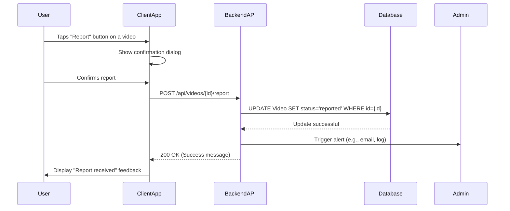

# Content Moderation - MVP Design

## Current Implementation Status
**Existing Infrastructure**: The project has a comprehensive moderation service (`ModerationService`) with content filtering, status enums, and extensive test coverage. Challenge model already includes moderation status fields. This design focuses on completing the missing API endpoints and mobile reporting interface.

## Architecture

The moderation system integrates into the existing Railway backend architecture. The comprehensive `ModerationService` provides content filtering capabilities, and the `Challenge` model includes moderation status fields. Missing components are the reporting API endpoints and mobile UI for user reports.

## Data Model Status

### Challenge (Backend - Moderation Fields Implemented ✅)

* `challenge_id`: UUID (Primary Key)
* `creator_id`: UUID
* `status`: ChallengeStatus (Enum includes: 'PENDING_MODERATION', 'MODERATED') ✅
* `created_at`: Timestamp
* `updated_at`: Timestamp

### ModerationService (Backend - Implemented ✅)

* `ModerationStatus`: Enum (PENDING, APPROVED, REJECTED, FLAGGED) ✅
* `ModerationReason`: Enum (comprehensive reasons including inappropriate_language, spam, etc.) ✅  
* `ModerationResult`: Class with status, confidence, reasons, details ✅

## API Endpoints (To Be Implemented)

### 1. Report a Challenge

* **Endpoint**: `POST /api/v1/challenges/{challenge_id}/report`
* **Request Body**: `{ "reason": "inappropriate_language", "details": "Optional description" }`
* **Success Response (200 OK)**: `{ "message": "Challenge reported successfully", "report_id": "report_uuid" }`
* **Error Response (404 Not Found)**: `{ "error": "Challenge not found" }`
* **Error Response (409 Conflict)**: `{ "error": "Challenge already reported by this user" }`

### 2. Get Reported Challenges (Admin)

* **Endpoint**: `GET /api/v1/admin/moderation/reports`
* **Query Parameters**: `?status=pending&limit=50&offset=0`
* **Success Response (200 OK)**: `[{ "challenge_id": "...", "status": "pending_moderation", "report_count": 3, "created_at": "...", ... }]`
* **Error Response (403 Forbidden)**: `{ "error": "Admin access required" }`

### 3. Review Reported Content (Admin)

* **Endpoint**: `PUT /api/v1/admin/moderation/challenges/{challenge_id}`
* **Request Body**: `{ "action": "approved", "reason": "content_acceptable", "notes": "Review notes" }`
* **Success Response (200 OK)**: `{ "message": "Moderation action applied", "new_status": "approved" }`

## Data Flow (Sequence Diagram)

This diagram visualizes the reporting process.

## Missing UI Components (To Be Implemented)

### 1. Report Button/Menu in Video Player
- Add report option to existing video player context menu or long-press gesture
- Integrate with current `FullscreenGuessScreen` and `GameScreen` components
- Include confirmation modal with report reason selection

### 2. Report Reason Selection Modal
- Dropdown or picker with predefined reasons (matching backend `ModerationReason` enum)
- Optional text field for additional details
- Submit and cancel actions

### 3. Report Confirmation Feedback
- Toast or modal confirming successful report submission
- User-friendly messaging about review process

## Integration Points

### Existing ModerationService Integration
- Extend existing `ModerationService` methods for API endpoint integration
- Leverage existing moderation status enums and result classes
- Maintain compatibility with current challenge status workflow

### Mobile UI Integration  
- Add report functionality to existing video player components
- Integrate with current navigation and modal patterns
- Preserve existing fullscreen video experience
