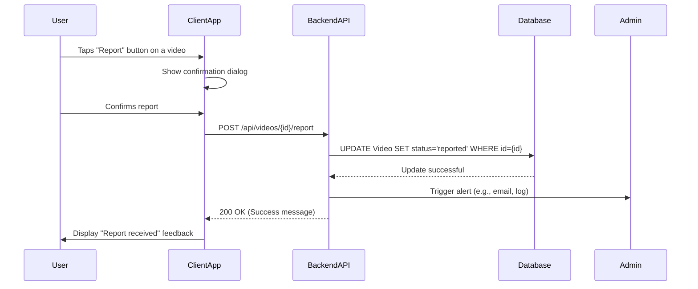

# Content Moderation - MVP Design

## Architecture

The moderation system will be integrated into the existing application architecture. It introduces a reporting mechanism for users and a simple review queue for administrators. A new API endpoint will handle report submissions, which will update the video's status in the database and trigger a notification for manual review. The admin review process will be handled out-of-band for the MVP.

## Data Model Changes

### Video

To support moderation, the `Video` model will be extended. Instead of a simple boolean, a `status` field provides more flexibility for future enhancements.

* `id`: UUID (Primary Key)
* `userId`: UUID
* `url`: String
* **`status`**: String (Enum: 'live', 'reported', 'removed') - Defaults to 'live'
* `createdAt`: Timestamp
* `updatedAt`: Timestamp

## API Endpoints

### 1. Report a Video

* **Endpoint**: `POST /api/videos/{id}/report`
* **Request Body**: (None)
* **Success Response (200 OK)**: `{ "message": "Video reported successfully" }`
* **Error Response (404 Not Found)**: `{ "error": "Video not found" }`

### 2. Get Reported Videos (Admin)

* **Endpoint**: `GET /api/admin/reports`
* **Success Response (200 OK)**: `[{ "id": "...", "url": "...", "status": "reported", ... }]`
* **Error Response (403 Forbidden)**: `{ "error": "Admin access required" }`

## Data Flow (Sequence Diagram)

This diagram visualizes the reporting process.

## Admin Review Workflow

For the MVP, the admin workflow is manual.

1.  An administrator is notified of a new report.
2.  The admin uses the `GET /api/admin/reports` endpoint (or a simple internal tool) to view the queue of reported videos.
3.  The admin reviews the content and decides on an action (e.g., leave as is, or remove).
4.  Content removal is handled manually via direct database access or a separate script to set the video status to 'removed'.
