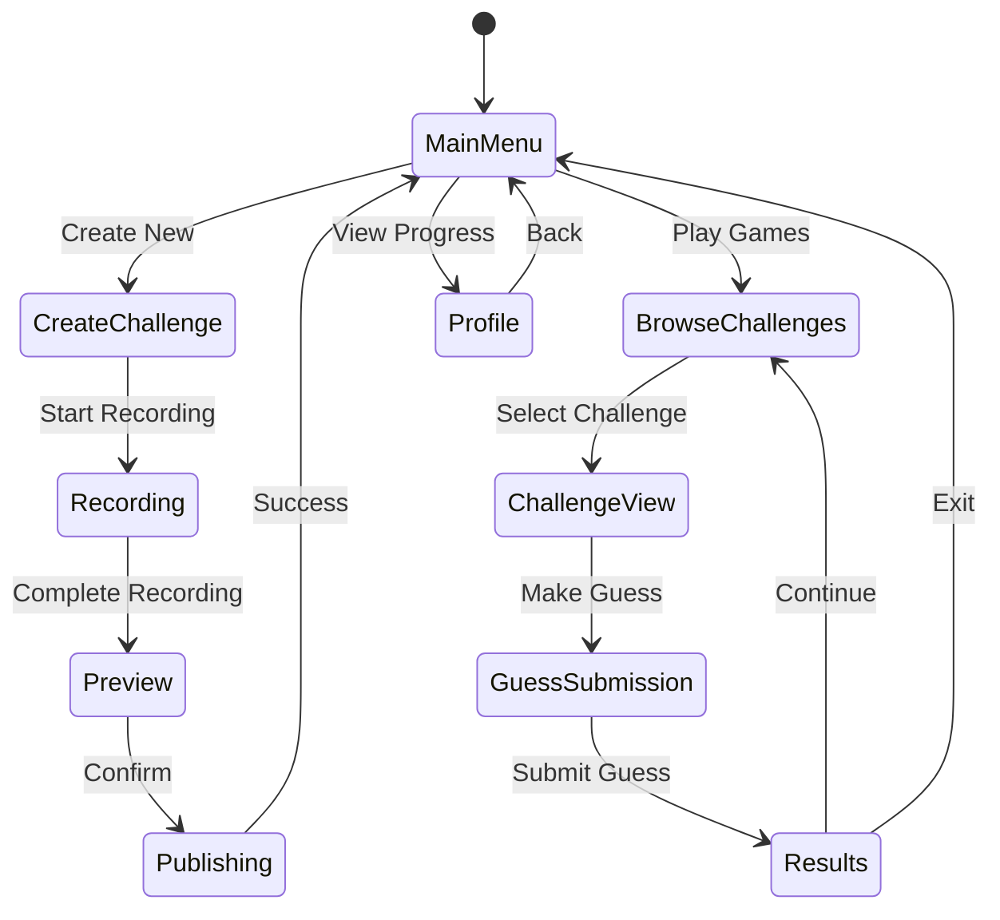

# Core Gameplay Flow - Design Document

## Overview

The core gameplay flow for 2Truths-1Lie is a dynamic cycle where users alternately create “Two Truths and a Lie” challenges and guess lies in others’ posts. This system promotes user engagement through social interaction, real-time feedback, progression milestones, and optional AI-enhanced emotion recognition aimed at unique gameplay enrichment and training AffectLink’s affective models.

The design leverages a scalable API backend, modular frontend components, and an extensible AI integration layer to enable iterative feature rollout and high user retention.

***

## Architecture

### Game State Management



***

### Core Game Loop Architecture

- **Creation Loop:** Users create challenges → record media & statements → preview and submit → receive feedback & points.
- **Consumption Loop:** Users browse challenges → analyze statements/media → make guesses → see results with feedback → accumulate points and unlock features.

***

### Technology Stack Integration

- **Frontend:** React/React Native with robust state management (Redux or Context API).
- **Backend:** FastAPI serving RESTful APIs, responsible for user, game, and media management.
- **State Management:** Redux/Vuex to handle client game state and UI responsiveness.
- **Real-time:** WebSockets for live notifications on guesses, leaderboard updates.
- **AI Integration:** Modular AffectLink emotion recognition API service with fallback mechanisms.

***

## Components and Interfaces

### 1. Game Session Manager

**Purpose:** Central controller managing gameplay session states, player position in loops, timing, and scoring.

```typescript
interface GameSession {
  sessionId: string;
  playerId: string;
  currentActivity: 'creating' | 'browsing' | 'guessing' | 'idle';
  startTime: Date;
  pointsEarned: number;
  challengesCompleted: number;
}
```

**Key Methods:**
- `startGameSession()`
- `updatePlayerProgress()`
- `calculateRewards()`
- `handleSessionTimeout()`

***

### 2. Challenge Creation Engine

**Purpose:** Manages challenge input, media capture, emotion analysis triggers, and submission validation.

```typescript
interface ChallengeCreation {
  statements: Statement[];
  mediaData: MediaCapture;
  emotionAnalysis?: EmotionScores;
  qualityScore?: number;
  estimatedDifficulty?: 'easy' | 'medium' | 'hard';
}
```

***

### 3. Guessing Game Engine

**Purpose:** Controls presenting challenges to guessers, capturing guesses, tracking confidence, and dynamic hinting.

```typescript
interface GuessingSession {
  challengeId: string;
  statements: AnalyzedStatement[];
  playerGuess: number | null;
  confidenceScores: number[];
  hintsUsed: number;
  timeSpent: number;
}
```

***

### 4. Progression System

**Purpose:** Tracks player levels, rewards, unlockables, and leaderboard standing.

```typescript
interface PlayerProgression {
  level: number;
  experiencePoints: number;
  totalGamesPlayed: number;
  accuracyRate: number;
  currentStreak: number;
  unlockedCosmetics: string[];
  achievements: Achievement[];
}
```

***

### 5. Feedback and Reward System

- Animated point notifications
- Celebration effects on achievements/unlocks
- Progressive reward reveals
- Social validation (community reactions, shares)

***

## Data Models (Expanded)

### Enhanced Challenge Model

```typescript
interface EnhancedChallenge extends Challenge {
  difficultyRating: number;
  averageGuessTime: number;
  popularityScore: number;
  emotionComplexity: number;
  recommendationWeight: number;
}
```

### Player Statistics Model

```typescript
interface PlayerStats {
  playerId: string;
  challengesCreated: number;
  challengesGuessed: number;
  correctGuesses: number;
  averageGuessTime: number;
  preferredDifficulty: string;
  dominantEmotionTypes: string[];
  weeklyActivity: ActivityMetrics;
}
```

***

## Error Handling & Resilience

- Network issues gracefully cached and synced.
- AI failures degrade to basic guessing mode without emotion overlays.
- Media capture failures fallback to text-only submissions.
- Automatic quality adjustment to maintain smooth 30+ FPS gameplay.

***

## Testing Strategy

- Unit test game logic, scoring, and state transitions.
- Integration test API endpoints including media upload and guesses.
- UI tests for progression and feedback components.
- Validate AI emotion scoring on known test data, and fallback behaviors.
- Conduct performance and cross-platform compatibility tests.

***

## Performance Considerations

- Client-side lazy loading and caching for media and leaderboard data.
- Indexed DB or localStorage for offline state persistence.
- Server-side DB indexing, horizontal scaling of game sessions.
- WebSocket optimization via pooling, debouncing.
- Emotion recognition batching and asynchronous processing.

***
