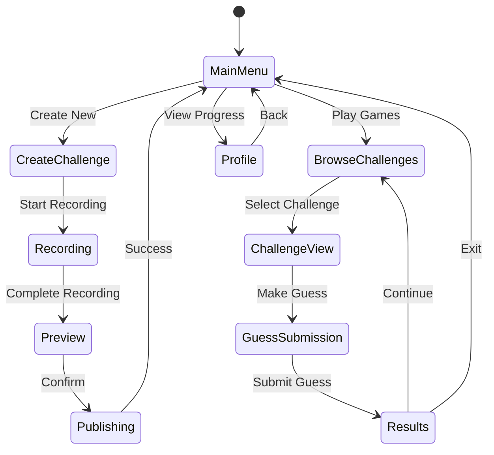

# Core Gameplay Flow - Design

## Overview

The core gameplay flow for 2Truths-1Lie is a dynamic cycle where users alternately create “Two Truths and a Lie” challenges and guess lies in others’ posts. This system promotes user engagement through social interaction, real-time feedback, progression milestones, and optional AI-enhanced emotion recognition aimed at unique gameplay enrichment and training AffectLink’s affective models.

The design leverages a scalable API backend, modular frontend components, and an extensible AI integration layer to enable iterative feature rollout and high user retention.

***

## Architecture

### Game State Management



***

### Core Game Loop Architecture

- **Creation Loop:** Players create challenges → record media & statements → preview and submit → receive immediate feedback and points.
- **Consumption Loop:** Players browse challenges → analyze statements/media → make guesses → see results with feedback → accumulate points and unlock features.

***

### Technology Stack Integration

- **Frontend Web:** React with Redux Toolkit for state management, React Scripts build system.
- **Frontend Mobile:** React Native with Expo SDK 53, Metro bundler, simplified Redux store for performance.
- **Backend:** FastAPI serving RESTful APIs for user, game, and media management.
- **State Management:** Redux Toolkit with sync-based sharing between web and mobile projects.
- **Real-time:** WebSockets for live notifications on guesses, leaderboard updates.
- **AI Integration:** Modular AffectLink emotion recognition API service with fallback (optional MVP feature).
- **Cross-Platform Development:** Sync workflow enabling shared business logic with platform-specific optimizations.

***

## Components and Interfaces

### 1. Game Session Manager

Manages gameplay session states, player position in loops, timing, and scoring.

```typescript
interface GameSession {
  sessionId: string;
  playerId: string;
  currentActivity: 'creating' | 'browsing' | 'guessing' | 'idle';
  startTime: Date;
  pointsEarned: number;
  challengesCompleted: number;
}
```

Key methods: session lifecycle, progression, rewards, idle hint triggers.

***

### 2. Challenge Creation and Media Capture

Manages entering three statements with lie selection and validation, plus video-only media capture with full mobile support:

- **Video with audio is the required recording modality**—no text input or fallback options.
- **Media capture UI components (RecordingControl, MediaPreview, UploadProgress) are integrated directly within the Challenge Creation screen, providing seamless user interaction throughout recording, preview, compression, and upload stages. State management (e.g., Redux) ensures synchronization between UI elements and overall challenge submission workflow.**
- **Mobile camera integration is implemented using Expo Camera APIs with permission prompts, device error handling, real-time preview, and touch-optimized controls.**
- Preview and re-record functionality for each statement.
- Client-side compression optimized for mobile devices.
- Local blob URL or secure file URI handling with optional cloud upload for production deployment.
- State management syncs recording data between mobile and web platforms for consistent challenge creation experiences.

```typescript
interface ChallengeCreation {
  statements: Statement[]; // Contains metadata only, no text content
  mediaData: MediaCapture[]; // Required video recordings for each statement
  emotionAnalysis?: EmotionScores; // optional later
  qualityScore?: number;
  estimatedDifficulty?: 'easy' | 'medium' | 'hard';
}
```

***

### 3. Challenge Publishing and Moderation

API backend for receiving, storing challenges and media, applying content moderation, rate limiting, and validation.

***

### 4. Guessing Engine and Gameplay

Supports browsing challenges, guess submissions, real-time feedback, hints, and results animations.

***

### 5. Progression and Rewards

Handles leveling, experience, badges, cosmetics, and leaderboards.

***

### 6. Emotion Analysis Integration (Optional MVP)

Real-time/batch AffectLink API integration for emotion scoring, overlays, and fallback modes.

***

## Error Handling & Resilience

- Network retry and offline queuing.
- Graceful fallbacks when AI or media fail.
- User-friendly error messages.

***

## Performance Considerations

- Client lazy loading and caching.
- IndexedDB/localStorage offline state.
- Scalable backend and CDNs.
- Efficient WebSocket and AI batching.

***

## Testing Strategy

- Unit/integration tests for logic, APIs, and media.
- E2E tests covering full user flow, including mobile device tests for media capture.
- Accessibility and cross-platform compatibility.
- AI scoring validation and fallback tests.
- Performance and stress testing.

***
