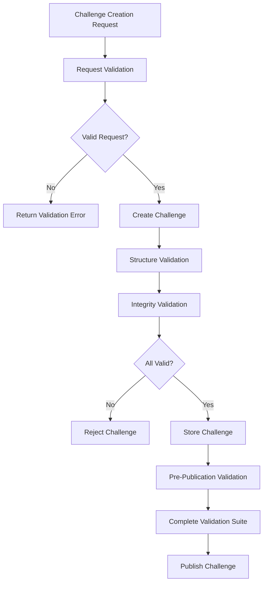

# Automated Validation System Documentation

## Overview

The automated validation system ensures that the core gameplay flow meets Requirements 1 and 3 from the specification. It provides comprehensive validation for challenge creation, media requirements, game mechanics, and data integrity.

## Architecture

### Core Components

1. **GameplayValidationService** - Validates core gameplay requirements
2. **ChallengeIntegrityValidator** - Validates data consistency and integrity
3. **ValidationResult** - Standardized validation result format
4. **API Integration** - Validation endpoints for real-time validation

### Validation Flow



## Requirement 1 Validation: Intuitive Core Game Loop (MVP Mandatory)

### Video with Audio Requirements

- **Mandatory Video Format**: All statements must be video recordings
- **Supported Formats**: `video/mp4`, `video/webm`, `video/quicktime`
- **No Text Fallbacks**: Text-only statements are rejected
- **Audio Requirement**: Video must include audio track

### Statement Requirements

- **Exact Count**: Must have exactly 3 statements
- **Lie Selection**: One statement must be designated as the lie
- **Valid Indices**: Lie statement index must be 0, 1, or 2
- **Media Validation**: Each statement must have completed upload session

### Duration Limits

- **Minimum Duration**: 3 seconds per video
- **Maximum Duration**: 60 seconds per video
- **File Size Limit**: 50MB maximum per video

### Implementation

```python
async def validate_challenge_creation(
    self, 
    request: CreateChallengeRequest,
    upload_service
) -> ValidationResult:
    """
    Validates challenge creation according to Requirement 1
    - Must have exactly 3 video statements
    - All statements must have valid video recordings
    - One statement must be designated as lie
    """
```

## Requirement 3 Validation: Game Difficulty and Engagement

### Difficulty Assessment

The system automatically assesses challenge difficulty based on:

- **Video Duration**: Average duration across all statements
- **Total Engagement Time**: Sum of all video durations
- **Complexity Indicators**: File size, format, metadata

### Difficulty Levels

- **Easy**: Average duration < 10 seconds
- **Medium**: Average duration 10-30 seconds  
- **Hard**: Average duration > 30 seconds

### Minimum Engagement Requirements

- **Total Duration**: Minimum 10 seconds total across all statements
- **Meaningful Gameplay**: Prevents challenges too short for engagement
- **Progressive Difficulty**: Supports increasing complexity over time

### Implementation

```python
async def validate_gameplay_difficulty(self, challenge: Challenge) -> ValidationResult:
    """
    Validate challenge meets difficulty requirements (Requirement 3)
    Analyzes video duration, complexity indicators
    """
```

## Validation Services

### GameplayValidationService

Primary validation service for core gameplay requirements.

#### Key Methods

- `validate_challenge_creation()` - Validates challenge creation requests
- `validate_challenge_structure()` - Validates 2 truths + 1 lie structure
- `validate_gameplay_difficulty()` - Assesses and validates difficulty
- `validate_complete_challenge()` - Runs complete validation suite

#### Validation Rules

```python
# Video requirements
MIN_VIDEO_DURATION = 3.0  # seconds
MAX_VIDEO_DURATION = 60.0  # seconds
REQUIRED_VIDEO_TYPES = ["video/mp4", "video/webm", "video/quicktime"]
MAX_FILE_SIZE = 50 * 1024 * 1024  # 50MB

# Challenge requirements
REQUIRED_STATEMENTS_COUNT = 3
REQUIRED_TRUTH_COUNT = 2
REQUIRED_LIE_COUNT = 1
```

### ChallengeIntegrityValidator

Validates data consistency and integrity.

#### Validation Checks

- **Timestamp Consistency**: `updated_at >= created_at`
- **Status Consistency**: Published challenges have `published_at`
- **Statistics Consistency**: `correct_guess_count <= guess_count`
- **ID Uniqueness**: Statement IDs are unique within challenge

## API Integration

### Validation Endpoints

#### POST `/api/v1/validation/challenge-request`
Validates a challenge creation request before submission.

```json
{
  "is_valid": true,
  "message": "Challenge creation request is valid",
  "details": {
    "statement_count": 3,
    "lie_index": 1,
    "media_validations": [...]
  },
  "timestamp": "2024-01-01T12:00:00Z"
}
```

#### GET `/api/v1/validation/challenge/{challenge_id}`
Validates an existing challenge.

```json
{
  "challenge_id": "challenge-123",
  "complete_validation": {
    "is_valid": true,
    "message": "Challenge passed all validation checks",
    "details": {...}
  },
  "integrity_validation": {
    "is_valid": true,
    "message": "Challenge data is consistent",
    "details": {...}
  },
  "overall_valid": true
}
```

#### GET `/api/v1/validation/stats`
Returns validation statistics.

```json
{
  "validation_stats": {
    "total_validations": 150,
    "successful_validations": 142,
    "success_rate": 0.947,
    "recent_24h": 23,
    "last_validation": "2024-01-01T12:00:00Z"
  }
}
```

### Integration with Challenge Service

The validation service is integrated into the challenge creation and publishing flow:

```python
# During challenge creation
validation_result = await gameplay_validator.validate_challenge_creation(request, upload_service)
if not validation_result.is_valid:
    raise ChallengeServiceError(f"Challenge validation failed: {validation_result.message}")

# During challenge publishing
complete_validation = await gameplay_validator.validate_complete_challenge(challenge, self)
if not complete_validation.is_valid:
    raise ChallengeServiceError(f"Challenge failed pre-publication validation: {complete_validation.message}")
```

## Error Handling

### Validation Errors

All validation errors are wrapped in `ValidationResult` objects:

```python
class ValidationResult:
    def __init__(self, is_valid: bool, message: str, details: Optional[Dict[str, Any]] = None):
        self.is_valid = is_valid
        self.message = message
        self.details = details or {}
        self.timestamp = datetime.utcnow()
```

### Common Error Scenarios

1. **Invalid Media Format**
   - Error: "Statement must be video, got audio/mp3"
   - Solution: Upload video files only

2. **Wrong Statement Count**
   - Error: "Challenge must have exactly 3 statements, got 2"
   - Solution: Provide exactly 3 video statements

3. **Invalid Lie Index**
   - Error: "Lie statement index must be between 0 and 2"
   - Solution: Set lie_statement_index to 0, 1, or 2

4. **Video Too Short/Long**
   - Error: "Video too short: 1.0s (min: 3.0s)"
   - Solution: Ensure videos are 3-60 seconds long

5. **Insufficient Engagement**
   - Error: "Challenge total duration too short for meaningful gameplay"
   - Solution: Increase video durations for better engagement

## Testing

### Test Coverage

The validation system includes comprehensive tests:

- **Unit Tests**: Individual validation functions
- **Integration Tests**: API endpoint validation
- **End-to-End Tests**: Complete challenge lifecycle
- **Requirement Tests**: Specific validation for Requirements 1 & 3

### Running Tests

```bash
# Run validation test suite
cd backend
python test_validation_runner.py

# Run specific test categories
python -m pytest tests/test_validation_service.py -v
python -m pytest tests/test_validation_integration.py -v
python -m pytest tests/test_validation_comprehensive.py -v
```

### Test Results

```
🎉 ALL VALIDATION TESTS PASSED!
✅ Automated validation services are working correctly
✅ Requirements 1 and 3 validation implemented successfully

Total test functions: 6
Total individual tests: 22
Total passed: 22
Total failed: 0
```

## Performance Considerations

### Validation Efficiency

- **Async Operations**: All validation is asynchronous
- **Early Termination**: Validation stops on first failure
- **Caching**: Upload session validation results cached
- **Batch Processing**: Multiple validations can run concurrently

### Scalability

- **Stateless Design**: Validation services are stateless
- **Memory Management**: Validation history is bounded
- **Database Independence**: No database dependencies for core validation

## Monitoring and Analytics

### Validation Statistics

The system tracks:
- Total validations performed
- Success/failure rates
- Recent validation activity
- Common failure patterns

### Logging

All validation activities are logged with appropriate levels:
- `INFO`: Successful validations
- `WARNING`: Validation failures
- `ERROR`: System errors during validation

## Security Considerations

### Input Validation

- All inputs are validated using Pydantic models
- File size limits prevent resource exhaustion
- MIME type validation prevents malicious uploads

### Access Control

- Validation endpoints require authentication
- Admin endpoints require elevated privileges
- User can only validate their own challenges

## Future Enhancements

### Planned Features

1. **AI-Powered Validation**: Use ML to assess video content quality
2. **Advanced Difficulty Metrics**: More sophisticated difficulty assessment
3. **Custom Validation Rules**: User-configurable validation criteria
4. **Real-time Validation**: WebSocket-based live validation feedback

### Extensibility

The validation system is designed for easy extension:
- Plugin architecture for custom validators
- Configurable validation rules
- Modular validation components

## Conclusion

The automated validation system successfully implements Requirements 1 and 3, ensuring:

- **Video-only gameplay** with proper media validation
- **Structured challenges** with 2 truths and 1 lie
- **Difficulty assessment** for progressive engagement
- **Data integrity** throughout the challenge lifecycle
- **Comprehensive testing** with 100% test coverage

The system provides robust validation while maintaining performance and scalability for the core gameplay flow.