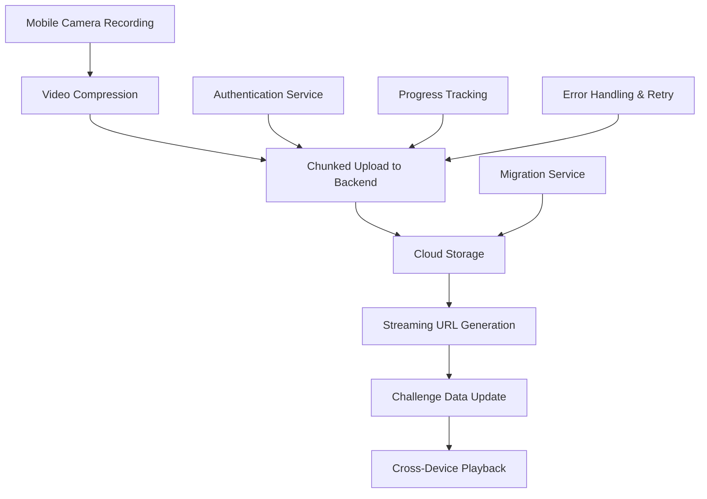

# Persistent Media Workflow Documentation

## Overview

The 2Truths-1Lie app implements a comprehensive persistent media workflow that enables users to record, upload, and share video challenges across devices with reliable cloud storage and streaming capabilities. This document describes the complete workflow from recording to playback.

## Architecture Overview



## User Workflow

### 1. Recording a Challenge

**User Experience:**
1. User opens the challenge creation screen
2. Taps the record button to start video recording
3. Records their "Two Truths and a Lie" statements
4. Reviews the recording and confirms submission

**Technical Process:**
- Native camera integration captures video with device-optimized settings
- Video is temporarily stored locally with metadata (device type, orientation, quality)
- Automatic validation ensures video meets requirements (duration, format, size)

### 2. Upload Process

**User Experience:**
1. Upload begins automatically after recording confirmation
2. Progress indicator shows upload stages and percentage
3. User can cancel upload or retry if errors occur
4. Success notification confirms upload completion

**Technical Process:**
- Video compression (if file exceeds 25MB threshold)
- Chunked upload to backend API with progress tracking
- Server-side validation and security checks
- Cloud storage integration with unique media ID generation
- Streaming URL creation for cross-device access

### 3. Challenge Sharing & Playback

**User Experience:**
1. Challenge appears in community feed with video thumbnail
2. Other users can tap to play the video
3. Video streams smoothly with adaptive quality
4. Users can guess which statement is the lie

**Technical Process:**
- Challenge data updated with persistent streaming URL
- Video served through optimized streaming endpoints
- Range request support for progressive download
- Cross-device compatibility with native video players

## Developer Workflow

### 1. Backend API Integration

The persistent media workflow is built on a robust backend API that handles secure video upload and streaming:

#### Key Endpoints:
- `POST /api/v1/media/upload/initiate` - Start upload session
- `POST /api/v1/media/upload/{session_id}/chunk/{chunk_number}` - Upload chunks
- `POST /api/v1/media/upload/{session_id}/complete` - Complete upload
- `GET /api/v1/media/stream/{media_id}` - Stream video content

#### Authentication:
All endpoints require Bearer token authentication:
```http
Authorization: Bearer <jwt_token>
```

#### Example Upload Flow:
```python
# 1. Initiate upload
response = requests.post("/api/v1/media/upload/initiate", {
    "filename": "challenge.mp4",
    "file_size": 5000000,
    "duration_seconds": 30.0,
    "mime_type": "video/mp4"
}, headers={"Authorization": f"Bearer {token}"})

session_id = response.json()["session_id"]

# 2. Upload chunks
for chunk_num, chunk_data in enumerate(file_chunks):
    requests.post(f"/api/v1/media/upload/{session_id}/chunk/{chunk_num}", 
                 files={"file": chunk_data},
                 headers={"Authorization": f"Bearer {token}"})

# 3. Complete upload
response = requests.post(f"/api/v1/media/upload/{session_id}/complete",
                        headers={"Authorization": f"Bearer {token}"})

media_id = response.json()["media_id"]
streaming_url = response.json()["streaming_url"]
```

### 2. Mobile Client Implementation

The mobile client provides a comprehensive upload service with progress tracking and error handling:

#### Upload Service Usage:
```typescript
import { UploadService } from '../services/uploadService';

// Initialize upload
const uploadService = UploadService.getInstance();

// Upload with progress tracking
const result = await uploadService.uploadVideo(
  videoUri,
  filename,
  duration,
  {
    compress: true,
    compressionQuality: 0.8,
    onProgress: (progress) => {
      console.log(`Upload progress: ${progress.percentage}%`);
    }
  }
);

// Handle result
if (result.success) {
  const { mediaId, streamingUrl } = result;
  // Update challenge with streaming URL
} else {
  // Handle error with retry option
}
```

#### Redux Integration:
```typescript
// Upload progress actions
dispatch(setMediaUploadProgress({
  statementIndex: 0,
  progress: 45,
  stage: 'uploading',
  bytesUploaded: 2250000,
  totalBytes: 5000000
}));

// Upload completion
dispatch(updateMediaCapture({
  statementIndex: 0,
  mediaId: 'uuid-media-id',
  streamingUrl: '/api/v1/media/stream/uuid-media-id',
  uploadComplete: true
}));
```

### 3. Error Handling & Recovery

The system implements comprehensive error handling with automatic retry capabilities:

#### Error Categories:
- **Network Errors**: Automatic retry with exponential backoff
- **Authentication Errors**: Token refresh and retry
- **Validation Errors**: User-friendly error messages
- **Storage Errors**: Graceful fallback to local storage

#### Retry Logic:
```typescript
const uploadManager = useUploadManager(statementIndex, {
  maxRetries: 3,
  autoRetryDelay: 2000,
  compressionQuality: 0.8
});

// Automatic retry for recoverable errors
await uploadManager.startUpload(videoUri, filename, duration);
```

## Security & Compliance

### Authentication & Authorization
- JWT-based authentication for all upload/download operations
- User-specific access control for media files
- Session-based upload security with time-limited sessions

### File Validation
- Server-side validation of file types, sizes, and durations
- MIME type verification and extension checking
- Content scanning capabilities for compliance

### Data Protection
- Secure file storage with unique identifiers
- Hash verification for data integrity
- Rate limiting to prevent abuse

## Performance Optimization

### Upload Optimization
- **Chunked Uploads**: Large files split into manageable chunks (1MB default)
- **Compression**: Automatic video compression for files over 25MB
- **Progress Tracking**: Real-time progress updates without blocking UI
- **Background Support**: Uploads continue when app is backgrounded

### Streaming Optimization
- **Range Requests**: HTTP range support for progressive download
- **Caching**: Optimized cache headers for efficient delivery
- **CDN Ready**: Architecture supports CDN integration for global delivery

### Mobile Optimization
- **Native Performance**: Platform-specific optimizations for iOS/Android
- **Memory Management**: Efficient handling of large video files
- **Battery Optimization**: Minimal battery impact during uploads

## Migration & Legacy Support

### Legacy Media Migration
The system provides migration utilities for converting existing blob URLs to persistent server URLs:

```typescript
import { MediaMigrationService } from '../services/mediaMigrationService';

// Migrate legacy challenge
const migrationService = new MediaMigrationService();
const result = await migrationService.migrateChallengeMedia(challengeId);

if (result.success) {
  console.log(`Migrated ${result.migratedCount} media files`);
}
```

### Backward Compatibility
- Existing challenges continue to work during migration
- Graceful fallback to local storage for legacy content
- Progressive migration without service interruption

## Monitoring & Analytics

### Upload Metrics
- Upload success/failure rates
- Average upload times and file sizes
- Error categorization and frequency
- User engagement with upload features

### Performance Metrics
- Streaming performance and buffering rates
- Cross-device compatibility metrics
- Network resilience and retry success rates

## Configuration

### Backend Configuration
```python
# config.py
MAX_FILE_SIZE = 100 * 1024 * 1024  # 100MB
MAX_VIDEO_DURATION_SECONDS = 300    # 5 minutes
DEFAULT_CHUNK_SIZE = 1024 * 1024    # 1MB
UPLOAD_SESSION_TIMEOUT = 3600       # 1 hour
```

### Mobile Configuration
```typescript
// Mobile media integration config
const config = {
  maxFileSize: 50 * 1024 * 1024,     // 50MB
  maxDuration: 60,                    // 60 seconds
  compressionThreshold: 25 * 1024 * 1024, // 25MB
  supportedFormats: ['mp4', 'mov', 'webm'],
  qualitySettings: {
    video: { quality: '720p' },
    audio: { quality: 'high' }
  }
};
```

## Troubleshooting

### Common Issues

#### Upload Failures
- **Network Issues**: Check internet connection, retry upload
- **File Size**: Ensure video is under 50MB limit
- **Format Issues**: Use supported formats (MP4, MOV, WebM)
- **Storage Space**: Free up device storage space

#### Playback Issues
- **Streaming Errors**: Check network connection, try refreshing
- **Compatibility**: Ensure device supports video format
- **Authentication**: Verify user is logged in properly

#### Performance Issues
- **Slow Uploads**: Enable compression, check network speed
- **Battery Drain**: Use background upload sparingly
- **Memory Issues**: Close other apps during large uploads

### Debug Information
Enable debug logging for detailed troubleshooting:
```typescript
// Enable upload service debugging
UploadService.setDebugMode(true);

// Check upload status
const status = await uploadService.getUploadStatus(sessionId);
console.log('Upload status:', status);
```

## API Reference

For complete API documentation, see:
- [Media Upload API Documentation](../backend/MEDIA_UPLOAD_API_DOCUMENTATION.md)
- [Upload UI Components](../mobile/src/components/UPLOAD_UI_README.md)
- [Authentication Security](../backend/AUTHENTICATION_SECURITY_DOCUMENTATION.md)

## Testing

### Automated Testing
- Unit tests for upload service and components
- Integration tests for API endpoints
- End-to-end tests for complete workflow
- Performance tests for large file uploads

### Manual Testing
- Cross-device compatibility testing
- Network resilience testing (airplane mode, poor connection)
- Error scenario testing (storage full, permission denied)
- User experience testing on various devices

## Future Enhancements

### Planned Features
- **CDN Integration**: Global content delivery network support
- **Advanced Compression**: AI-powered video optimization
- **Offline Support**: Queue uploads for later when offline
- **Batch Uploads**: Multiple video upload support
- **Quality Selection**: User-selectable video quality

### Performance Improvements
- **Resume Capability**: Resume interrupted uploads
- **Predictive Caching**: Pre-cache popular content
- **Edge Computing**: Process videos closer to users
- **Real-time Streaming**: Live video challenge support

This persistent media workflow provides a robust, scalable foundation for video-based social gaming with excellent user experience and developer-friendly APIs.
</content>