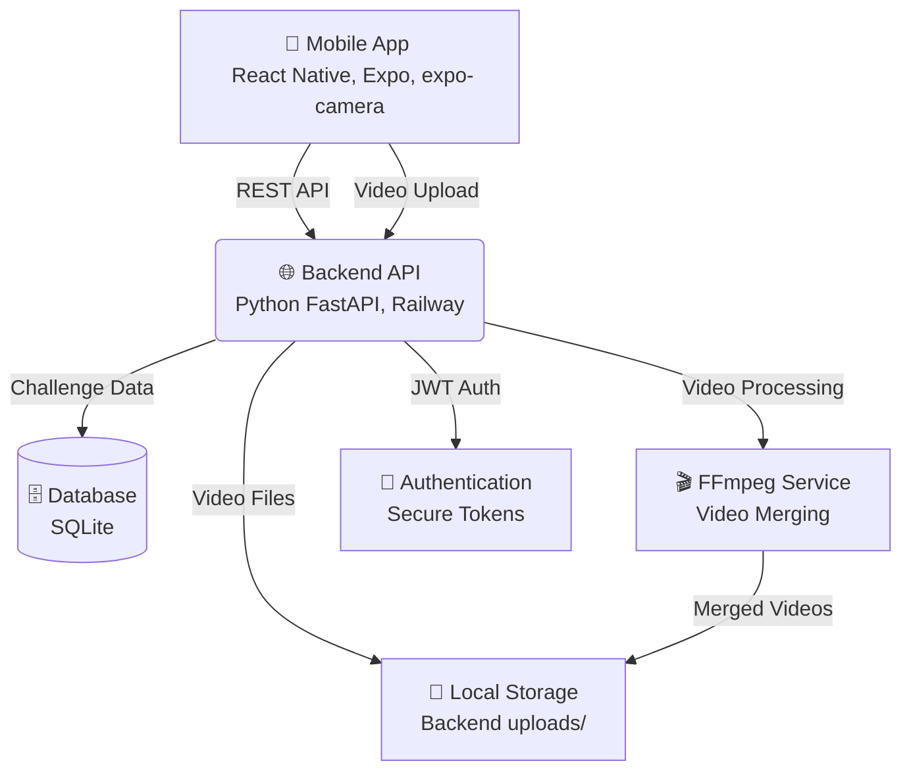

# 📚 2Truths-1Lie: Documentation Hub

> **Production-Ready Mobile Social Game** | **Google Play Store Live** | **RevenueCat Shipaton Winner**

**Quick Navigation**: [🏆 Project Overview](#-what-is-2truths-1lie) • [🚀 Get Started](#-quick-start) • [🏗 Architecture](#-technical-architecture) • [⚙️ Admin Guide](ADMIN_GUIDE.md) • [📋 API Docs](api.md)

---

## 🏆 **RevenueCat Shipaton Submission**

This project evolved from a hackathon prototype into a **production-ready monetized mobile app**, demonstrating the complete journey from concept to Google Play Store deployment with integrated RevenueCat monetization.

### 🎯 **Submission Materials**
- **🎬 Demo Video**: [submission_materials/](../submission_materials/) 
- **📱 Live App**: Google Play Store with QR code access
- **💰 Monetization**: Full RevenueCat integration with subscriptions and consumables
- **📊 Analytics**: Complete revenue tracking and user engagement metrics

### 🚀 **Production Achievements**
- **✅ Google Play Store**: Live deployment with working monetization
- **✅ RevenueCat Integration**: Subscriptions, consumables, and webhooks
- **✅ Production Backend**: Railway deployment with comprehensive APIs
- **✅ Complete Game Loop**: Recording, challenges, scoring, and progression

---

## 🎮 **What is 2Truths-1Lie?**

A **production-ready mobile social game** that modernizes the classic party icebreaker with sophisticated video recording and processing. Players create video challenges combining true and false statements, with community voting and engagement features.

### ✨ **Core Features**
- **📹 Advanced Video Recording**: expo-camera integration with permission handling and validation
- **🎬 Real-time Video Processing**: FFmpeg-powered backend for seamless video merging
- **🔐 Secure Authentication**: JWT-based user system with production deployment
- **☁️ Production Backend**: FastAPI server deployed on Railway with SQLite database
- **📱 Mobile App**: React Native with EAS Build for Google Play Store deployment

### 🏆 **Production Achievements**
- **✅ Live Google Play Store App**: Successfully deployed with working video features
- **✅ Railway Backend**: Production FastAPI server with monitoring
- **✅ Video Pipeline**: Complete recording → upload → processing → viewing workflow
- **✅ EAS Build Integration**: Proper signing credentials and deployment automation

---

## 🚀 **Quick Start**

Get the project running on your local machine in under 5 minutes.

**Prerequisites:** Node.js (v18+), Python (v3.10+), and the Expo Go app on your mobile device.

```bash
# Clone repository
git clone https://github.com/kingkw1/2Truths-1Lie.git
cd 2Truths-1Lie

# Start backend server
cd backend
pip install -r requirements.txt
python run.py

# Launch mobile app
cd mobile
npm install
npx expo start
```

**📱 Scan QR code with Expo Go app to test immediately**

---

## 🏗 **Technical Architecture**

Modern, decoupled architecture designed for scalability:



**Key Technical Achievements:**
- **Mobile Video Pipeline**: Complex expo-camera workflows with validation
- **Backend Processing**: FFmpeg integration for professional video merging  
- **Production Deployment**: Railway + EAS Build for scalable hosting
- **Security**: JWT authentication with proper mobile integration

---

## 💰 **Monetization & RevenueCat**

Complete monetization strategy implemented for sustainable growth:

### 💎 **Premium Features**
- **Pro Subscriptions**: Unlimited challenge creation + Pro badge
- **Token System**: Consumable hints with intelligent hint functionality
- **Progressive Rewards**: Score-based progression and achievements
- **Social Features**: Enhanced sharing and community engagement

### 🔗 **RevenueCat Integration**
- **Subscription Management**: Monthly/Annual Pro plans
- **Webhook Processing**: Real-time purchase verification and token grants
- **Analytics**: Revenue tracking and user engagement metrics
- **Cross-Platform**: Consistent monetization across iOS/Android

---

## 📚 **Documentation Structure**

### 📍 **Essential Starting Points**
| Document | Purpose |
|----------|---------|
| **[API Documentation](api.md)** | Complete REST API reference |
| **[Technical Architecture](TECHNICAL_ARCHITECTURE.md)** | System design and component relationships |
| **[Security Checklist](SECURITY_CHECKLIST.md)** | Production security implementation |

### 🏗️ **Architecture & Development**
- **[Mobile Development Guide](MOBILE_GUIDE.md)** - React Native setup and patterns
- **[Backend Guide](BACKEND_GUIDE.md)** - Python FastAPI development guide
- **[Admin Guide](ADMIN_GUIDE.md)** - System administration and moderation tools
- **[API Documentation](api.md)** - Complete REST API reference
- **[Deployment Guide](DEPLOYMENT_GUIDE.md)** - Production deployment processes

### 🧪 **Testing & Quality**
- **[Testing Guide](TESTING_GUIDE.md)** - Comprehensive testing strategies
- **[Contributing Guidelines](CONTRIBUTING.md)** - How to contribute to the project

### 💰 **Monetization & Setup**
- **[RevenueCat Setup Guide](REVENUECAT_SETUP.md)** - Complete monetization implementation

---

## 📁 **Repository Structure**

```
2Truths-1Lie/
├── README.md                    # 🏠 Main project homepage
├── mobile/                      # 📱 React Native mobile app
├── backend/                     # 🖥 Python FastAPI server
├── docs/                        # 📚 This documentation hub
├── submission_materials/        # 🏆 RevenueCat Shipaton submission assets
├── scripts/                     # 🔧 Development and testing scripts
├── tools/                       # 🛠 Utilities and validation tools
└── assets/                      # 🎨 App icons and graphics
```

---

## 🎯 **For Different Audiences**

### 🏆 **RevenueCat Shipaton Judges**
1. **Start here**: [Main README](../README.md) for project overview
2. **Monetization**: [RevenueCat Setup Guide](REVENUECAT_SETUP.md) for implementation details
3. **Technical Details**: [Technical Architecture](TECHNICAL_ARCHITECTURE.md)
4. **Live Demo**: [submission_materials/](../submission_materials/) for QR code and access

### 👨‍💻 **Developers**
1. **Getting Started**: Follow the [Quick Start](#-quick-start) guide above
2. **Mobile Development**: [Mobile Guide](MOBILE_GUIDE.md) 
3. **Backend Development**: [Backend Guide](BACKEND_GUIDE.md)
4. **API Integration**: [API Documentation](api.md)

### 🔧 **Contributors**
1. **How to Contribute**: [Contributing Guidelines](CONTRIBUTING.md)
2. **Testing Strategy**: [Testing Guide](TESTING_GUIDE.md)
3. **Deployment Process**: [Deployment Guide](DEPLOYMENT_GUIDE.md)

---

## 📊 **Project Status**

### ✅ **Production Ready**
- **Mobile App**: Live on Google Play Store with video recording
- **Backend API**: Deployed on Railway with JWT authentication  
- **Video Processing**: FFmpeg-powered merging and validation
- **RevenueCat**: Full monetization with subscriptions and consumables

### 🎯 **Key Differentiators**
- **Production Quality**: Real app with working video features deployed to store
- **Advanced Video Processing**: Sophisticated mobile camera + backend FFmpeg integration
- **Complete Monetization**: RevenueCat integration with multiple revenue streams
- **Full-Stack**: Complete React Native + FastAPI + Railway deployment

---

## 🔗 **External Resources**

### 🛠 **Development Tools**
- [React Native Docs](https://reactnative.dev/docs/getting-started)
- [Expo Documentation](https://docs.expo.dev/)
- [FastAPI Documentation](https://fastapi.tiangolo.com/)
- [EAS Build Guide](https://docs.expo.dev/build/introduction/)

### ☁️ **Deployment Platforms**
- [Railway Documentation](https://docs.railway.app/)
- [Google Play Console](https://play.google.com/console/)
- [RevenueCat Documentation](https://docs.revenuecat.com/)

---

**Last Updated**: October 1, 2025  
**Documentation Version**: 5.0 (RevenueCat Shipaton)  
**Status**: Production Ready with Monetization ✅

---

<div align="center">
Built with ❤️ for the RevenueCat Shipaton 💰
</div>