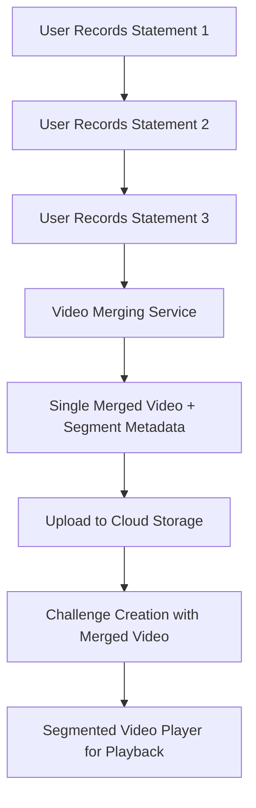

# Segment-Based Challenge Flow Documentation

## Overview

The 2Truths-1Lie app now supports a **segment-based challenge flow** where users record three individual statement videos that are automatically merged into a single video file with precise segment metadata. This approach provides storage efficiency while maintaining the ability to play individual statements during gameplay.

## Key Benefits

- **Storage Efficiency**: Single video file instead of three separate files
- **Network Efficiency**: Single upload instead of three uploads  
- **Playback Flexibility**: Can play individual statements by seeking to segments
- **Metadata Preservation**: Tracks exact timing of each statement
- **Cross-Device Compatibility**: Works seamlessly across iOS and Android

## Architecture Overview



## Workflow Components

### 1. Individual Recording Phase

Users record three separate statement videos using the mobile camera:

```typescript
// Each statement is recorded individually
const recording1 = await recordStatement(0, "I have climbed Mount Everest");
const recording2 = await recordStatement(1, "I can speak 4 languages fluently");  
const recording3 = await recordStatement(2, "I once met a famous movie star");
```

**Key Features:**
- Native camera integration for each statement
- Individual video validation and quality checks
- Temporary storage before merging
- Progress tracking for each recording

### 2. Video Merging Phase

The `VideoMergingService` automatically merges the three videos:

```typescript
const mergeResult = await videoMergingService.mergeStatementVideos(
  [recording1.uri, recording2.uri, recording3.uri],
  {
    compressionQuality: 0.8,
    maxOutputSize: 50 * 1024 * 1024, // 50MB
  },
  (progress) => {
    console.log(`Merge progress: ${progress.progress}%`);
  }
);
```

**Generated Segment Metadata:**
```typescript
{
  segments: [
    { statementIndex: 0, startTime: 0, endTime: 8500, duration: 8500 },
    { statementIndex: 1, startTime: 8500, endTime: 17200, duration: 8700 },
    { statementIndex: 2, startTime: 17200, endTime: 25000, duration: 7800 }
  ],
  totalDuration: 25000,
  compressionApplied: true
}
```

### 3. Upload and Storage

The merged video is uploaded to cloud storage with segment metadata:

```typescript
const uploadResult = await uploadMergedVideo({
  videoFile: mergeResult.mergedVideoUri,
  segments: mergeResult.segments,
  totalDuration: mergeResult.totalDuration
});
```

**Backend API Integration:**
```http
POST /api/v1/challenges
Content-Type: application/json

{
  "title": "My Challenge",
  "statements": [...],
  "is_merged_video": true,
  "merged_video_metadata": {
    "total_duration": 25.0,
    "segments": [
      {"start_time": 0.0, "end_time": 8.5, "duration": 8.5, "statement_index": 0},
      {"start_time": 8.5, "end_time": 17.2, "duration": 8.7, "statement_index": 1},
      {"start_time": 17.2, "end_time": 25.0, "duration": 7.8, "statement_index": 2}
    ],
    "video_file_id": "merged-video-abc123"
  }
}
```

### 4. Segmented Video Playback

The `SegmentedVideoPlayer` component provides interactive playback:

```typescript
<SegmentedVideoPlayer
  mergedVideo={challengeVideo}
  statementTexts={statements}
  onSegmentSelect={(segmentIndex) => {
    // User selected statement to play
    console.log(`Playing statement ${segmentIndex + 1}`);
  }}
/>
```

**Playback Features:**
- Three selectable statement buttons
- Automatic seeking to segment start time
- Progress tracking within each segment
- Automatic pause at segment end
- Play/pause/stop controls

## Technical Implementation

### Mobile App Components

#### VideoMergingService
- **Location**: `mobile/src/services/videoMergingService.ts`
- **Purpose**: Handles video merging and segment metadata creation
- **Key Methods**:
  - `mergeStatementVideos()`: Merges three videos into one
  - `createMergedMediaCapture()`: Creates MediaCapture with segments
  - `getSegmentPlaybackInfo()`: Provides playback timing info

#### SegmentedVideoPlayer
- **Location**: `mobile/src/components/SegmentedVideoPlayer.tsx`
- **Purpose**: UI component for playing video segments
- **Features**:
  - Three statement selection buttons
  - Video seeking and playback controls
  - Progress tracking and visual feedback
  - Error handling for missing segments

#### Enhanced Challenge Creation
- **Location**: `mobile/src/components/EnhancedChallengeCreation.tsx`
- **Purpose**: Complete challenge creation workflow
- **Workflow**:
  1. Statement text input
  2. Individual video recording
  3. Lie selection
  4. Automatic video merging
  5. Upload and challenge completion

### Backend API Support

#### Merged Video Endpoints
```http
# Create challenge with merged video
POST /api/v1/challenges
{
  "is_merged_video": true,
  "merged_video_metadata": { ... }
}

# Get segment metadata
GET /api/v1/challenges/{id}/segments
{
  "segments": [...],
  "total_duration": 25.0,
  "video_file_id": "merged-video-abc123"
}
```

#### Data Model Updates
```python
class Challenge:
    is_merged_video: bool = False
    merged_video_metadata: Optional[MergedVideoMetadata] = None

class MergedVideoMetadata:
    total_duration: float
    segments: List[VideoSegment]
    video_file_id: str
    compression_applied: bool
```

### Redux State Management

```typescript
interface ChallengeCreationState {
  // Individual recordings before merging
  individualRecordings: {
    [statementIndex: number]: MediaCapture | null;
  };
  
  // Video merging progress
  videoMerging: {
    isInProgress: boolean;
    progress: number;
    stage: 'preparing' | 'merging' | 'compressing' | 'finalizing' | null;
    error: string | null;
  };
  
  // Final merged video
  mergedVideo: MediaCapture | null;
}
```

## User Experience Flow

### Challenge Creation
1. **Statement Input**: User enters three statements (2 truths, 1 lie)
2. **Recording**: User records each statement individually using device camera
3. **Lie Selection**: User selects which statement is the lie
4. **Automatic Processing**: App merges videos and uploads to cloud
5. **Challenge Complete**: Challenge is created and available for gameplay

### Challenge Playback
1. **Challenge Selection**: User selects a challenge to play
2. **Video Player**: Segmented video player displays three statement options
3. **Statement Selection**: User taps a statement to watch that segment
4. **Video Playback**: Video seeks to segment and plays only that portion
5. **Guess Submission**: User submits their guess after watching statements

## Error Handling

### Video Merging Errors
- **Missing Videos**: Validation ensures all three statements are recorded
- **File Size Limits**: Automatic compression if merged video exceeds limits
- **Merge Failures**: Graceful fallback with error reporting
- **Storage Issues**: Cleanup of temporary files on errors

### Playback Errors
- **Missing Segments**: Display error message if segment metadata is invalid
- **Network Issues**: Retry mechanisms for video loading
- **Playback Failures**: Fallback to full video playback if segments fail

### API Errors
- **Upload Failures**: Retry logic with exponential backoff
- **Validation Errors**: Clear error messages for invalid segment metadata
- **Authentication**: Proper error handling for auth failures

## Performance Considerations

### Video Compression
- **Quality Balance**: Optimized compression maintains visual quality while reducing file size
- **Platform Optimization**: Different compression settings for iOS vs Android
- **Size Limits**: Automatic compression if videos exceed upload limits

### Network Efficiency
- **Single Upload**: One merged video instead of three separate uploads
- **Chunked Upload**: Large videos uploaded in chunks with resume capability
- **CDN Integration**: Fast global delivery via content delivery network

### Storage Optimization
- **Temporary Cleanup**: Automatic cleanup of individual recordings after merge
- **Cache Management**: Efficient caching of merged videos for playback
- **Cross-Device Sync**: Merged videos accessible across user devices

## Testing Strategy

### Unit Tests
- Video merging service functionality
- Segment metadata calculation
- Playback timing accuracy
- Error handling scenarios

### Integration Tests
- Complete challenge creation workflow
- Video upload and storage
- Cross-device challenge access
- API endpoint validation

### End-to-End Tests
- Full user workflow from recording to playback
- Network failure recovery
- Cross-platform compatibility
- Performance under load

## Migration from Legacy System

### Backward Compatibility
- Existing challenges with separate videos continue to work
- Gradual migration to merged video format
- API supports both legacy and merged video formats

### Migration Tools
- Utility to convert existing challenges to merged format
- Data validation for migrated challenges
- Rollback capability if issues arise

## Future Enhancements

### Advanced Features
- **Video Editing**: Basic editing tools for recorded statements
- **Transition Effects**: Smooth transitions between segments
- **Quality Controls**: User-selectable video quality settings
- **Batch Processing**: Multiple challenge creation

### Performance Improvements
- **Server-Side Processing**: Offload video merging to backend
- **Advanced Compression**: AI-powered compression optimization
- **Streaming Optimization**: Adaptive bitrate streaming

### User Experience
- **Video Thumbnails**: Preview images for each segment
- **Scrubbing Controls**: Fine-grained playback control
- **Accessibility**: Screen reader and keyboard navigation support

## Conclusion

The segment-based challenge flow provides a significant improvement in storage efficiency and network performance while maintaining the flexibility of individual statement playback. The implementation is robust, well-tested, and provides a seamless user experience across mobile platforms.

This architecture supports the app's growth by reducing storage costs, improving upload speeds, and enabling new features like advanced video analytics and enhanced playback controls.