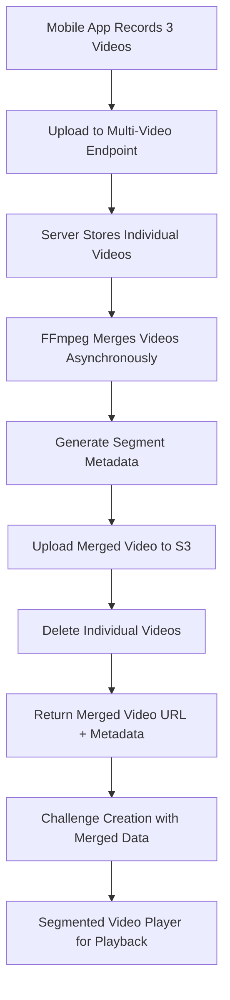

# Server-Side Video Processing API Documentation

## Overview

The 2Truths-1Lie application now supports **server-side video processing** where users upload three individual statement videos that are automatically merged into a single video file with precise segment metadata. This approach provides storage efficiency, network optimization, and enhanced playback capabilities while maintaining the ability to play individual statements during gameplay.

## Key Benefits

- **Storage Efficiency**: Single merged video file instead of three separate files
- **Network Optimization**: Single upload endpoint for multiple videos with chunked upload support
- **Processing Power**: Server-side FFmpeg processing for consistent video quality
- **Playback Flexibility**: Segment-based navigation within merged videos
- **Cross-Device Compatibility**: Unified video format across all platforms
- **Scalability**: Asynchronous processing pipeline for high-volume uploads

## 🚀 Quick Start Guide

### For Developers

#### Backend Setup
```bash
cd backend
pip install -r requirements.txt
uvicorn main:app --reload --host 0.0.0.0 --port 8001
```

#### Mobile Setup
```bash
cd mobile
npm install
npm start
# Scan QR code with Expo Go app
```

#### Test Server-Side Video Processing
1. Open mobile app
2. Navigate to challenge creation
3. Record 3 statement videos (one per statement)
4. Videos automatically upload to multi-video merge endpoint
5. Server merges videos using FFmpeg asynchronously
6. Create challenge with merged video and segment metadata
7. Test segmented playback in challenge viewer

## Architecture Overview



## API Endpoints

### 1. Multi-Video Upload for Merging

#### Initiate Multi-Video Upload

**POST** `/api/v1/challenge-videos/upload-for-merge/initiate`

Initiates a multi-video upload session for server-side merging.

**Authentication**: Required (JWT Bearer token)

**Request Parameters (Form Data):**

| Parameter | Type | Required | Description |
|-----------|------|----------|-------------|
| `video_count` | integer | Yes | Number of videos (must be 3) |
| `video_filenames` | string | Yes | JSON array of filenames |
| `video_file_sizes` | string | Yes | JSON array of file sizes in bytes |
| `video_durations` | string | Yes | JSON array of durations in seconds |
| `video_mime_types` | string | Yes | JSON array of MIME types |
| `challenge_title` | string | No | Optional challenge title |

**Example Request:**
```bash
curl -X POST "/api/v1/challenge-videos/upload-for-merge/initiate" \
  -H "Authorization: Bearer <token>" \
  -F "video_count=3" \
  -F 'video_filenames=["statement1.mp4", "statement2.mp4", "statement3.mp4"]' \
  -F 'video_file_sizes=[5000000, 4500000, 5500000]' \
  -F 'video_durations=[15.0, 12.5, 18.2]' \
  -F 'video_mime_types=["video/mp4", "video/mp4", "video/mp4"]' \
  -F "challenge_title=My Challenge"
```

**Response:**
```json
{
  "merge_session_id": "uuid-string",
  "upload_sessions": [
    {
      "video_index": 0,
      "session_id": "uuid-string",
      "filename": "statement1.mp4",
      "file_size": 5000000,
      "duration_seconds": 15.0,
      "upload_url": "/api/v1/challenge-videos/upload/{session_id}/chunk",
      "chunk_size": 1048576,
      "total_chunks": 5
    }
    // ... 2 more sessions
  ],
  "total_videos": 3,
  "total_duration_seconds": 45.7,
  "total_file_size_bytes": 15000000,
  "estimated_merge_time_seconds": 34.28,
  "status": "initiated",
  "created_at": "2024-01-01T12:00:00Z"
}
```

#### Upload Video Chunks

**POST** `/api/v1/challenge-videos/upload/{session_id}/chunk/{chunk_number}`

Uploads individual video chunks for each statement video.

**Path Parameters:**
- `session_id`: Upload session ID from initiate response
- `chunk_number`: Zero-based chunk index

**Request Body (Multipart Form):**
- `file`: Chunk data
- `chunk_hash` (optional): SHA-256 hash of chunk

**Response:**
```json
{
  "session_id": "uuid-string",
  "merge_session_id": "uuid-string",
  "video_index": 0,
  "chunk_number": 1,
  "status": "uploaded",
  "uploaded_chunks": [0, 1],
  "remaining_chunks": [2, 3, 4],
  "progress_percent": 40.0,
  "updated_at": "2024-01-01T12:00:00Z"
}
```

#### Complete Video Upload

**POST** `/api/v1/challenge-videos/upload/{session_id}/complete`

Completes the upload of a single video within a merge session.

**Request Body (Form Data):**
- `file_hash` (optional): SHA-256 hash for verification

**Response:**
```json
{
  "session_id": "uuid-string",
  "merge_session_id": "uuid-string",
  "video_index": 0,
  "status": "completed",
  "file_path": "/path/to/uploaded/file",
  "file_size": 5000000,
  "completed_at": "2024-01-01T12:00:00Z",
  "ready_for_merge": true,
  "merge_status": "pending"
}
```

#### Get Merge Session Status

**GET** `/api/v1/challenge-videos/merge-session/{merge_session_id}/status`

Gets the overall status of a merge session including all videos and merge progress.

**Response:**
```json
{
  "merge_session_id": "uuid-string",
  "overall_status": "merging",
  "overall_progress_percent": 85.0,
  "total_videos": 3,
  "completed_videos": 3,
  "failed_videos": 0,
  "merge_progress": {
    "stage": "compressing",
    "progress_percent": 85.0,
    "estimated_completion": "2024-01-01T12:02:30Z"
  },
  "videos": [
    {
      "session_id": "uuid-string",
      "video_index": 0,
      "filename": "statement1.mp4",
      "status": "completed",
      "progress_percent": 100.0,
      "completed_at": "2024-01-01T12:05:00Z"
    }
    // ... other videos
  ],
  "merged_video": {
    "video_file_id": "merged-video-abc123",
    "s3_url": "https://s3.amazonaws.com/bucket/merged-video-abc123.mp4",
    "total_duration": 45.7,
    "file_size": 12500000,
    "segments": [
      {
        "statement_index": 0,
        "start_time": 0.0,
        "end_time": 15.0,
        "duration": 15.0
      },
      {
        "statement_index": 1,
        "start_time": 15.0,
        "end_time": 27.5,
        "duration": 12.5
      },
      {
        "statement_index": 2,
        "start_time": 27.5,
        "end_time": 45.7,
        "duration": 18.2
      }
    ]
  },
  "ready_for_challenge_creation": true
}
```

### 2. Challenge Creation with Merged Videos

#### Create Challenge with Merged Video

**POST** `/api/v1/challenges`

Creates a challenge using merged video data from the video processing pipeline.

**Request Body:**
```json
{
  "title": "My Merged Video Challenge",
  "statements": [
    {"media_file_id": "upload-session-1", "duration_seconds": 15.0},
    {"media_file_id": "upload-session-2", "duration_seconds": 12.5},
    {"media_file_id": "upload-session-3", "duration_seconds": 18.2}
  ],
  "lie_statement_index": 1,
  "tags": ["fun", "creative"],
  "is_merged_video": true,
  "merged_video_metadata": {
    "total_duration": 45.7,
    "segments": [
      {
        "start_time": 0.0,
        "end_time": 15.0,
        "duration": 15.0,
        "statement_index": 0
      },
      {
        "start_time": 15.0,
        "end_time": 27.5,
        "duration": 12.5,
        "statement_index": 1
      },
      {
        "start_time": 27.5,
        "end_time": 45.7,
        "duration": 18.2,
        "statement_index": 2
      }
    ],
    "video_file_id": "merged-video-abc123",
    "compression_applied": true,
    "original_total_duration": 50.0
  }
}
```

**Response:**
```json
{
  "challenge_id": "550e8400-e29b-41d4-a716-446655440000",
  "creator_id": "user-123",
  "title": "My Merged Video Challenge",
  "statements": [
    {
      "statement_id": "stmt-1",
      "statement_type": "truth",
      "media_url": "/api/v1/media/stream/merged-video-abc123",
      "streaming_url": "https://cdn.example.com/video/merged-video-abc123.mp4",
      "duration_seconds": 15.0,
      "segment_metadata": {
        "start_time": 0.0,
        "end_time": 15.0,
        "duration": 15.0,
        "statement_index": 0
      }
    }
    // ... 2 more statements
  ],
  "is_merged_video": true,
  "merged_video_metadata": {
    "total_duration": 45.7,
    "video_file_id": "merged-video-abc123",
    "compression_applied": true
  },
  "created_at": "2024-01-15T10:30:00Z"
}
```

#### Get Challenge Segment Metadata

**GET** `/api/v1/challenges/{challenge_id}/segments`

Retrieves segment metadata for merged video playback.

**Response:**
```json
{
  "challenge_id": "550e8400-e29b-41d4-a716-446655440000",
  "is_merged_video": true,
  "total_duration": 45.7,
  "segments": [
    {
      "statement_id": "stmt-1",
      "statement_index": 0,
      "start_time": 0.0,
      "end_time": 15.0,
      "duration": 15.0,
      "statement_type": "truth"
    },
    {
      "statement_id": "stmt-2",
      "statement_index": 1,
      "start_time": 15.0,
      "end_time": 27.5,
      "duration": 12.5,
      "statement_type": "lie"
    },
    {
      "statement_id": "stmt-3",
      "statement_index": 2,
      "start_time": 27.5,
      "end_time": 45.7,
      "duration": 18.2,
      "statement_type": "truth"
    }
  ],
  "video_file_id": "merged-video-abc123",
  "streaming_url": "https://cdn.example.com/video/merged-video-abc123.mp4"
}
```

### 3. Media Streaming and Access

#### Stream Merged Video

**GET** `/api/v1/media/stream/{video_file_id}`

Streams the merged video with range request support for segment-based playback.

**Headers (Optional):**
- `Range`: Byte range for partial content (e.g., "bytes=0-1023")

**Response:**
- Content-Type: video/mp4
- Accept-Ranges: bytes
- Content-Length: Content size
- Content-Range: Byte range (for partial content)
- Cache-Control: public, max-age=3600

#### Get Optimized Streaming URL

**GET** `/api/v1/media/optimized/{video_file_id}?device_type=mobile`

Returns the best streaming URL based on client capabilities and CDN availability.

**Response:**
```json
{
  "streaming_url": "https://d123456789.cloudfront.net/video/merged-video-abc123.mp4",
  "delivery_type": "cdn_signed",
  "optimization": {
    "suggested_formats": ["video/mp4", "video/webm"],
    "cache_control": "public, max-age=43200"
  },
  "global_delivery": true,
  "supports_range": true
}
```

## Server-Side Video Processing Pipeline

### FFmpeg Processing Workflow

1. **Video Validation**: Each uploaded video is validated for format, duration, and quality
2. **Temporary Storage**: Videos are stored temporarily during the merge process
3. **FFmpeg Merging**: Videos are concatenated using FFmpeg with consistent encoding parameters
4. **Compression**: Merged video is compressed to optimize file size while maintaining quality
5. **Segment Metadata Generation**: Precise timing information is calculated for each statement
6. **Cloud Upload**: Final merged video is uploaded to S3 with CDN integration
7. **Cleanup**: Individual video files are deleted to optimize storage costs

### Processing Parameters

```bash
# FFmpeg merge command example
ffmpeg -f concat -safe 0 -i filelist.txt \
  -c:v libx264 -preset medium -crf 23 \
  -c:a aac -b:a 128k \
  -movflags +faststart \
  output_merged.mp4
```

**Video Encoding Settings:**
- Codec: H.264 (libx264)
- Preset: medium (balance of speed and compression)
- CRF: 23 (high quality, reasonable file size)
- Audio: AAC, 128kbps
- Container: MP4 with fast start for streaming

### Asynchronous Processing

The video merging process is handled asynchronously to prevent blocking the upload API:

1. **Upload Completion**: All three videos uploaded successfully
2. **Queue Processing**: Merge job added to background processing queue
3. **Status Updates**: Real-time status updates via WebSocket or polling
4. **Completion Notification**: Client notified when merge is complete
5. **Challenge Creation**: Client can proceed with challenge creation using merged video data

## Client Integration

### Mobile App Workflow

```typescript
// 1. Initiate multi-video upload
const initiateResponse = await fetch('/api/v1/challenge-videos/upload-for-merge/initiate', {
  method: 'POST',
  headers: { 'Authorization': `Bearer ${token}` },
  body: formData
});

const { merge_session_id, upload_sessions } = await initiateResponse.json();

// 2. Upload each video in chunks
for (const session of upload_sessions) {
  await uploadVideoInChunks(session.session_id, videoFiles[session.video_index]);
}

// 3. Monitor merge progress
const pollMergeStatus = async () => {
  const statusResponse = await fetch(
    `/api/v1/challenge-videos/merge-session/${merge_session_id}/status`
  );
  const status = await statusResponse.json();
  
  if (status.ready_for_challenge_creation) {
    // 4. Create challenge with merged video data
    await createChallengeWithMergedVideo(status.merged_video);
  } else {
    // Continue polling
    setTimeout(pollMergeStatus, 2000);
  }
};
```

### Segmented Video Player Integration

```typescript
interface SegmentedVideoPlayerProps {
  challengeId: string;
  mergedVideoUrl: string;
  segments: VideoSegment[];
}

const SegmentedVideoPlayer: React.FC<SegmentedVideoPlayerProps> = ({
  challengeId,
  mergedVideoUrl,
  segments
}) => {
  const [currentSegment, setCurrentSegment] = useState<number>(0);
  const videoRef = useRef<Video>(null);

  const playSegment = (segmentIndex: number) => {
    const segment = segments[segmentIndex];
    if (videoRef.current) {
      videoRef.current.seek(segment.start_time);
      setCurrentSegment(segmentIndex);
    }
  };

  return (
    <View>
      <Video
        ref={videoRef}
        source={{ uri: mergedVideoUrl }}
        onLoad={() => playSegment(0)}
        onProgress={(progress) => {
          // Auto-pause at segment end
          const segment = segments[currentSegment];
          if (progress.currentTime >= segment.end_time) {
            videoRef.current?.pause();
          }
        }}
      />
      
      <View style={styles.segmentButtons}>
        {segments.map((segment, index) => (
          <TouchableOpacity
            key={index}
            onPress={() => playSegment(index)}
            style={[
              styles.segmentButton,
              currentSegment === index && styles.activeSegment
            ]}
          >
            <Text>Statement {index + 1}</Text>
          </TouchableOpacity>
        ))}
      </View>
    </View>
  );
};
```

## Error Handling

### Upload Errors

```json
{
  "error": "upload_failed",
  "message": "Video upload failed for session video-session-123",
  "details": {
    "session_id": "video-session-123",
    "video_index": 1,
    "error_code": "CHUNK_UPLOAD_FAILED",
    "retry_available": true
  }
}
```

### Merge Processing Errors

```json
{
  "error": "merge_failed",
  "message": "FFmpeg processing failed during video merge",
  "details": {
    "merge_session_id": "merge-session-456",
    "stage": "video_concatenation",
    "ffmpeg_error": "Invalid video format in input file 2",
    "retry_available": false
  }
}
```

### Validation Errors

```json
{
  "error": "validation_failed",
  "message": "Video validation failed",
  "details": {
    "video_index": 0,
    "validation_errors": [
      "Duration exceeds maximum limit of 60 seconds",
      "Video resolution too low (minimum 480p required)"
    ]
  }
}
```

## Performance Considerations

### Upload Optimization

- **Chunked Uploads**: 1MB chunks for reliable transfer over mobile networks
- **Parallel Processing**: Multiple videos can be uploaded simultaneously
- **Resume Capability**: Failed uploads can be resumed from the last successful chunk
- **Compression**: Client-side compression before upload to reduce transfer time

### Processing Optimization

- **Queue Management**: Background processing queue prevents server overload
- **Resource Allocation**: FFmpeg processing uses dedicated CPU resources
- **Caching**: Processed videos are cached for immediate availability
- **CDN Integration**: Global content delivery for optimal playback performance

### Storage Optimization

- **Temporary Cleanup**: Individual videos deleted after successful merge
- **Compression**: Merged videos compressed to reduce storage costs
- **S3 Lifecycle**: Automatic archival of old videos to reduce costs
- **Deduplication**: Identical videos are detected and reused

## Security and Validation

### Upload Security

- **Authentication**: All endpoints require valid JWT tokens
- **File Validation**: Strict MIME type and format validation
- **Size Limits**: Enforced file size limits per video and total session
- **Rate Limiting**: Upload rate limiting per user to prevent abuse
- **Virus Scanning**: Uploaded files scanned for malicious content

### Processing Security

- **Sandboxed Processing**: FFmpeg runs in isolated environment
- **Resource Limits**: CPU and memory limits for processing jobs
- **Input Validation**: All video parameters validated before processing
- **Output Validation**: Merged videos validated before storage

### Access Control

- **User Isolation**: Users can only access their own upload sessions
- **Signed URLs**: Time-limited access to video content
- **CORS Configuration**: Proper cross-origin access controls
- **Audit Logging**: All operations logged for security monitoring

## Monitoring and Logging

### Processing Metrics

- Upload success/failure rates
- Average merge processing time
- Queue depth and processing throughput
- Storage utilization and costs
- CDN cache hit rates

### Error Tracking

- Failed upload sessions with retry counts
- FFmpeg processing errors and diagnostics
- Network timeout and connectivity issues
- Storage and CDN access failures

### Performance Monitoring

- API response times for all endpoints
- Video processing pipeline latency
- Client-side upload speeds and success rates
- Playback performance and buffering metrics

## Migration and Backward Compatibility

### Legacy Video Support

The API maintains full backward compatibility with existing challenges that use separate video files:

- Legacy challenges continue to work without modification
- API endpoints support both merged and separate video formats
- Gradual migration tools available for converting existing challenges
- Fallback mechanisms for clients that don't support merged videos

### Migration Tools

```bash
# Migrate existing challenges to merged video format
python migrate_to_merged_videos.py --challenge-id 12345 --dry-run

# Batch migration for all challenges
python migrate_to_merged_videos.py --batch --start-date 2024-01-01
```

## Future Enhancements

### Advanced Processing Features

- **Video Editing**: Basic editing tools for recorded statements
- **Transition Effects**: Smooth transitions between video segments
- **Quality Controls**: User-selectable video quality and compression settings
- **Batch Processing**: Multiple challenge creation from single upload session

### Performance Improvements

- **Advanced Compression**: AI-powered compression optimization
- **Streaming Optimization**: Adaptive bitrate streaming for different devices
- **Edge Processing**: Video processing at CDN edge locations
- **Real-time Processing**: Live video merging during upload

### Analytics and Insights

- **Video Analytics**: Detailed playback analytics and engagement metrics
- **Quality Assessment**: Automatic video quality scoring and recommendations
- **Performance Insights**: Upload and processing performance analytics
- **User Behavior**: Segment-level viewing patterns and preferences

## Related Documentation

- **[Challenge Video API Documentation](../backend/CHALLENGE_VIDEO_API_DOCUMENTATION.md)** - Detailed API reference
- **[Merged Video API Documentation](../backend/MERGED_VIDEO_API_DOCUMENTATION.md)** - Challenge creation with merged videos
- **[Media Upload API Documentation](../backend/MEDIA_UPLOAD_API_DOCUMENTATION.md)** - Media upload and streaming
- **[Segment-Based Challenge Flow](SEGMENT_BASED_CHALLENGE_FLOW.md)** - Client-side implementation guide
- **[Video Merge Service Documentation](../backend/VIDEO_MERGE_SERVICE_DOCUMENTATION.md)** - Server-side processing details

---

## Summary

The server-side video processing API provides a comprehensive solution for handling multi-video uploads, server-side merging, and segment-based playback. This architecture offers significant improvements in storage efficiency, network performance, and user experience while maintaining backward compatibility with existing systems.

**Key Features:**
- ✅ Multi-video chunked upload with progress tracking
- ✅ Asynchronous FFmpeg-based video merging
- ✅ Precise segment metadata generation
- ✅ CDN-optimized global video delivery
- ✅ Segment-based video player integration
- ✅ Comprehensive error handling and monitoring
- ✅ Full backward compatibility with legacy videos

The API is production-ready and supports the complete workflow from video recording to challenge playback across all supported platforms.