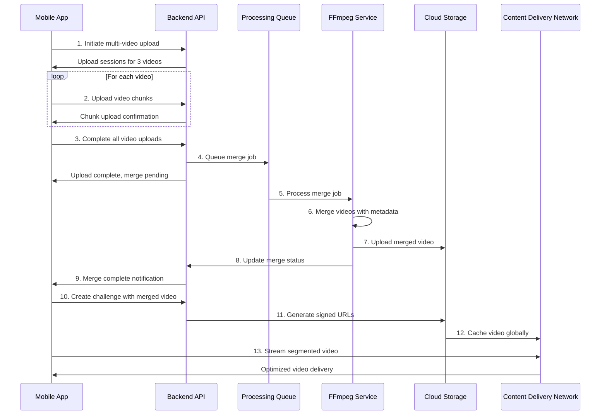

<!-- ARCHIVED - DO NOT USE - Moved to archive September 10, 2025 -->
<!-- This file is historical documentation only. See main docs/ folder for current information -->

# Server-Side Media Flow Documentation

## Overview

This document describes the complete media flow for the 2Truths-1Lie application, focusing on the new server-side video processing pipeline that merges individual statement videos into a single optimized video file with segment metadata.

## Media Flow Architecture



## Detailed Media Flow Steps

### Phase 1: Video Upload Initiation

#### 1.1 Multi-Video Upload Request
```typescript
// Mobile app initiates upload for 3 statement videos
const uploadRequest = {
  video_count: 3,
  video_filenames: ["statement1.mp4", "statement2.mp4", "statement3.mp4"],
  video_file_sizes: [5000000, 4500000, 5500000],
  video_durations: [15.0, 12.5, 18.2],
  video_mime_types: ["video/mp4", "video/mp4", "video/mp4"],
  challenge_title: "My Challenge"
};

const response = await fetch('/api/v1/challenge-videos/upload-for-merge/initiate', {
  method: 'POST',
  headers: { 'Authorization': `Bearer ${token}` },
  body: createFormData(uploadRequest)
});
```

#### 1.2 Server Response with Upload Sessions
```json
{
  "merge_session_id": "merge-abc123",
  "upload_sessions": [
    {
      "video_index": 0,
      "session_id": "upload-session-1",
      "filename": "statement1.mp4",
      "upload_url": "/api/v1/challenge-videos/upload/upload-session-1/chunk",
      "chunk_size": 1048576,
      "total_chunks": 5
    }
    // ... sessions for videos 2 and 3
  ],
  "estimated_merge_time_seconds": 34.28,
  "status": "initiated"
}
```

### Phase 2: Chunked Video Upload

#### 2.1 Parallel Chunk Upload
```typescript
// Upload each video in parallel using chunked upload
const uploadPromises = uploadSessions.map(async (session) => {
  const videoFile = videoFiles[session.video_index];
  const chunks = createChunks(videoFile, session.chunk_size);
  
  for (let i = 0; i < chunks.length; i++) {
    await uploadChunk(session.session_id, i, chunks[i]);
  }
  
  return completeVideoUpload(session.session_id);
});

await Promise.all(uploadPromises);
```

#### 2.2 Upload Progress Tracking
```typescript
// Real-time progress updates for each video
const trackUploadProgress = (sessionId: string) => {
  return new Promise((resolve) => {
    const pollStatus = async () => {
      const status = await getUploadStatus(sessionId);
      
      updateUI({
        sessionId,
        progress: status.progress_percent,
        uploadedChunks: status.uploaded_chunks.length,
        totalChunks: status.total_chunks
      });
      
      if (status.status === 'completed') {
        resolve(status);
      } else {
        setTimeout(pollStatus, 1000);
      }
    };
    
    pollStatus();
  });
};
```

### Phase 3: Server-Side Video Processing

#### 3.1 Merge Job Queuing
```python
# Backend queues merge job when all videos are uploaded
async def queue_merge_job(merge_session_id: str):
    merge_job = {
        "merge_session_id": merge_session_id,
        "video_files": get_uploaded_video_files(merge_session_id),
        "processing_params": {
            "output_format": "mp4",
            "video_codec": "libx264",
            "audio_codec": "aac",
            "crf": 23,
            "preset": "medium"
        },
        "priority": "normal",
        "created_at": datetime.utcnow()
    }
    
    await processing_queue.enqueue(merge_job)
    await update_merge_status(merge_session_id, "queued")
```

#### 3.2 FFmpeg Video Merging
```python
# FFmpeg processing service merges videos
async def process_merge_job(merge_job):
    try:
        # Update status to processing
        await update_merge_status(merge_job["merge_session_id"], "processing")
        
        # Create file list for FFmpeg concat
        file_list = create_concat_file_list(merge_job["video_files"])
        
        # Execute FFmpeg merge command
        ffmpeg_cmd = [
            "ffmpeg",
            "-f", "concat",
            "-safe", "0",
            "-i", file_list,
            "-c:v", "libx264",
            "-preset", "medium",
            "-crf", "23",
            "-c:a", "aac",
            "-b:a", "128k",
            "-movflags", "+faststart",
            output_file
        ]
        
        result = await run_ffmpeg_command(ffmpeg_cmd)
        
        # Generate segment metadata
        segments = calculate_segment_metadata(merge_job["video_files"])
        
        # Upload to cloud storage
        cloud_url = await upload_to_s3(output_file)
        
        # Update merge status with results
        await update_merge_status(merge_job["merge_session_id"], "completed", {
            "merged_video_url": cloud_url,
            "segments": segments,
            "total_duration": sum(v["duration"] for v in merge_job["video_files"]),
            "file_size": get_file_size(output_file)
        })
        
        # Cleanup temporary files
        await cleanup_temporary_files(merge_job["video_files"])
        
    except Exception as e:
        await update_merge_status(merge_job["merge_session_id"], "failed", {
            "error": str(e),
            "retry_available": True
        })
```

#### 3.3 Segment Metadata Calculation
```python
def calculate_segment_metadata(video_files):
    segments = []
    current_time = 0.0
    
    for index, video_file in enumerate(video_files):
        duration = video_file["duration_seconds"]
        
        segment = {
            "statement_index": index,
            "start_time": current_time,
            "end_time": current_time + duration,
            "duration": duration
        }
        
        segments.append(segment)
        current_time += duration
    
    return segments
```

### Phase 4: Challenge Creation

#### 4.1 Merge Completion Notification
```typescript
// Mobile app polls for merge completion
const pollMergeStatus = async (mergeSessionId: string) => {
  const status = await fetch(
    `/api/v1/challenge-videos/merge-session/${mergeSessionId}/status`
  ).then(r => r.json());
  
  if (status.overall_status === 'completed') {
    // Merge is complete, proceed with challenge creation
    return status.merged_video;
  } else if (status.overall_status === 'failed') {
    throw new Error(`Merge failed: ${status.error_message}`);
  } else {
    // Continue polling
    await new Promise(resolve => setTimeout(resolve, 2000));
    return pollMergeStatus(mergeSessionId);
  }
};
```

#### 4.2 Challenge Creation with Merged Video
```typescript
// Create challenge using merged video data
const createChallengeWithMergedVideo = async (mergedVideoData) => {
  const challengeRequest = {
    title: "My Challenge",
    statements: [
      { media_file_id: "upload-session-1", duration_seconds: 15.0 },
      { media_file_id: "upload-session-2", duration_seconds: 12.5 },
      { media_file_id: "upload-session-3", duration_seconds: 18.2 }
    ],
    lie_statement_index: 1,
    is_merged_video: true,
    merged_video_metadata: {
      total_duration: mergedVideoData.total_duration,
      segments: mergedVideoData.segments,
      video_file_id: mergedVideoData.video_file_id,
      compression_applied: true
    }
  };
  
  const challenge = await fetch('/api/v1/challenges', {
    method: 'POST',
    headers: {
      'Content-Type': 'application/json',
      'Authorization': `Bearer ${token}`
    },
    body: JSON.stringify(challengeRequest)
  }).then(r => r.json());
  
  return challenge;
};
```

### Phase 5: Video Streaming and Playback

#### 5.1 CDN-Optimized Streaming
```typescript
// Get optimized streaming URL for device
const getOptimizedStreamingUrl = async (videoFileId: string) => {
  const response = await fetch(
    `/api/v1/media/optimized/${videoFileId}?device_type=mobile&prefer_signed=true`
  );
  
  const streamingData = await response.json();
  
  return {
    url: streamingData.streaming_url,
    deliveryType: streamingData.delivery_type, // 'cdn_signed'
    supportsRange: streamingData.supports_range,
    globalDelivery: streamingData.global_delivery
  };
};
```

#### 5.2 Segment-Based Video Player
```typescript
// Segmented video player component
const SegmentedVideoPlayer = ({ challengeId, segments }) => {
  const [videoUrl, setVideoUrl] = useState<string>('');
  const [currentSegment, setCurrentSegment] = useState<number>(0);
  const videoRef = useRef<Video>(null);
  
  useEffect(() => {
    // Load optimized streaming URL
    const loadVideo = async () => {
      const segmentData = await fetch(`/api/v1/challenges/${challengeId}/segments`)
        .then(r => r.json());
      
      const streamingData = await getOptimizedStreamingUrl(segmentData.video_file_id);
      setVideoUrl(streamingData.url);
    };
    
    loadVideo();
  }, [challengeId]);
  
  const playSegment = (segmentIndex: number) => {
    const segment = segments[segmentIndex];
    if (videoRef.current) {
      // Seek to segment start time
      videoRef.current.seek(segment.start_time);
      setCurrentSegment(segmentIndex);
    }
  };
  
  const handleProgress = (progress: VideoProgress) => {
    const segment = segments[currentSegment];
    
    // Auto-pause at segment end
    if (progress.currentTime >= segment.end_time) {
      videoRef.current?.pause();
    }
  };
  
  return (
    <View>
      <Video
        ref={videoRef}
        source={{ uri: videoUrl }}
        onProgress={handleProgress}
        resizeMode="contain"
        controls={true}
      />
      
      <View style={styles.segmentControls}>
        {segments.map((segment, index) => (
          <TouchableOpacity
            key={index}
            onPress={() => playSegment(index)}
            style={[
              styles.segmentButton,
              currentSegment === index && styles.activeSegment
            ]}
          >
            <Text>Statement {index + 1}</Text>
            <Text style={styles.duration}>
              {formatDuration(segment.duration)}
            </Text>
          </TouchableOpacity>
        ))}
      </View>
    </View>
  );
};
```

## Performance Optimizations

### Upload Performance

#### Parallel Processing
- Multiple videos uploaded simultaneously
- Chunked upload with resume capability
- Progress tracking for each video independently
- Automatic retry for failed chunks

#### Network Optimization
```typescript
// Adaptive chunk size based on network conditions
const getOptimalChunkSize = (networkType: string) => {
  switch (networkType) {
    case 'wifi': return 2 * 1024 * 1024; // 2MB
    case '4g': return 1 * 1024 * 1024;   // 1MB
    case '3g': return 512 * 1024;        // 512KB
    default: return 256 * 1024;          // 256KB
  }
};
```

### Processing Performance

#### Queue Management
```python
# Priority-based processing queue
class ProcessingQueue:
    def __init__(self):
        self.high_priority = asyncio.Queue()
        self.normal_priority = asyncio.Queue()
        self.low_priority = asyncio.Queue()
    
    async def enqueue(self, job, priority='normal'):
        queue = getattr(self, f"{priority}_priority")
        await queue.put(job)
    
    async def dequeue(self):
        # Process high priority first
        if not self.high_priority.empty():
            return await self.high_priority.get()
        elif not self.normal_priority.empty():
            return await self.normal_priority.get()
        else:
            return await self.low_priority.get()
```

#### Resource Management
```python
# FFmpeg resource limits
FFMPEG_LIMITS = {
    "max_concurrent_jobs": 4,
    "memory_limit": "2G",
    "cpu_limit": "2",
    "timeout": 300  # 5 minutes
}

async def run_ffmpeg_with_limits(command):
    return await asyncio.create_subprocess_exec(
        *command,
        stdout=asyncio.subprocess.PIPE,
        stderr=asyncio.subprocess.PIPE,
        limit=FFMPEG_LIMITS["memory_limit"]
    )
```

### Streaming Performance

#### CDN Integration
```python
# CloudFront signed URL generation
def generate_signed_url(video_file_id: str, expires_in: int = 7200):
    cloudfront_url = f"{CDN_BASE_URL}/video/{video_file_id}.mp4"
    
    # Create signed URL with expiration
    signed_url = create_signed_url(
        url=cloudfront_url,
        key_pair_id=CDN_KEY_PAIR_ID,
        private_key_path=CDN_PRIVATE_KEY_PATH,
        expires_in=expires_in
    )
    
    return signed_url
```

#### Range Request Support
```python
# HTTP range request handling for video seeking
@app.get("/api/v1/media/stream/{video_file_id}")
async def stream_video(video_file_id: str, request: Request):
    range_header = request.headers.get('range')
    
    if range_header:
        # Parse range header
        start, end = parse_range_header(range_header)
        
        # Stream partial content
        return StreamingResponse(
            stream_video_range(video_file_id, start, end),
            status_code=206,
            headers={
                'Content-Range': f'bytes {start}-{end}/{total_size}',
                'Accept-Ranges': 'bytes',
                'Content-Length': str(end - start + 1)
            },
            media_type='video/mp4'
        )
    else:
        # Stream full video
        return StreamingResponse(
            stream_full_video(video_file_id),
            media_type='video/mp4'
        )
```

## Error Handling and Recovery

### Upload Error Recovery

#### Automatic Retry Logic
```typescript
const uploadChunkWithRetry = async (
  sessionId: string, 
  chunkNumber: number, 
  chunkData: Blob,
  maxRetries: number = 3
) => {
  for (let attempt = 1; attempt <= maxRetries; attempt++) {
    try {
      return await uploadChunk(sessionId, chunkNumber, chunkData);
    } catch (error) {
      if (attempt === maxRetries) {
        throw new Error(`Chunk upload failed after ${maxRetries} attempts: ${error.message}`);
      }
      
      // Exponential backoff
      const delay = Math.pow(2, attempt) * 1000;
      await new Promise(resolve => setTimeout(resolve, delay));
    }
  }
};
```

#### Resume Capability
```typescript
const resumeUpload = async (sessionId: string) => {
  // Get current upload status
  const status = await getUploadStatus(sessionId);
  
  // Resume from last uploaded chunk
  const remainingChunks = status.remaining_chunks;
  const videoFile = getVideoFile(sessionId);
  
  for (const chunkNumber of remainingChunks) {
    const chunkData = extractChunk(videoFile, chunkNumber);
    await uploadChunkWithRetry(sessionId, chunkNumber, chunkData);
  }
  
  return completeVideoUpload(sessionId);
};
```

### Processing Error Recovery

#### Merge Failure Handling
```python
async def handle_merge_failure(merge_session_id: str, error: Exception):
    # Log error details
    logger.error(f"Merge failed for session {merge_session_id}: {error}")
    
    # Determine if retry is possible
    retry_available = not isinstance(error, (ValidationError, UnsupportedFormatError))
    
    # Update status with error information
    await update_merge_status(merge_session_id, "failed", {
        "error_message": str(error),
        "error_type": type(error).__name__,
        "retry_available": retry_available,
        "failed_at": datetime.utcnow()
    })
    
    # Cleanup temporary files
    await cleanup_merge_session_files(merge_session_id)
    
    # Notify client of failure
    await notify_merge_failure(merge_session_id, error)
```

#### Automatic Retry for Transient Failures
```python
async def retry_merge_job(merge_session_id: str):
    # Get original merge job
    original_job = await get_merge_job(merge_session_id)
    
    # Create retry job with higher priority
    retry_job = {
        **original_job,
        "retry_count": original_job.get("retry_count", 0) + 1,
        "priority": "high",
        "retry_of": merge_session_id
    }
    
    # Queue retry job
    await processing_queue.enqueue(retry_job, priority="high")
```

## Monitoring and Analytics

### Real-Time Monitoring

#### Processing Pipeline Metrics
```python
# Metrics collection for monitoring
class ProcessingMetrics:
    def __init__(self):
        self.upload_success_rate = Counter()
        self.merge_processing_time = Histogram()
        self.queue_depth = Gauge()
        self.error_count = Counter()
    
    def record_upload_success(self, session_id: str):
        self.upload_success_rate.inc(labels={"status": "success"})
    
    def record_merge_time(self, duration_seconds: float):
        self.merge_processing_time.observe(duration_seconds)
    
    def record_queue_depth(self, depth: int):
        self.queue_depth.set(depth)
```

#### Health Check Endpoints
```python
@app.get("/api/v1/health/processing")
async def processing_health_check():
    return {
        "processing_queue": {
            "depth": await get_queue_depth(),
            "active_jobs": await get_active_job_count(),
            "failed_jobs_last_hour": await get_failed_job_count(hours=1)
        },
        "ffmpeg_service": {
            "available": await check_ffmpeg_availability(),
            "version": await get_ffmpeg_version(),
            "resource_usage": await get_ffmpeg_resource_usage()
        },
        "storage": {
            "s3_accessible": await check_s3_connectivity(),
            "cdn_accessible": await check_cdn_connectivity(),
            "disk_space": await get_disk_space_info()
        }
    }
```

### Performance Analytics

#### Upload Performance Tracking
```typescript
// Client-side performance tracking
const trackUploadPerformance = (uploadSession: UploadSession) => {
  const startTime = Date.now();
  let bytesUploaded = 0;
  
  const onProgress = (progress: UploadProgress) => {
    bytesUploaded = progress.bytesUploaded;
    
    const elapsedTime = Date.now() - startTime;
    const uploadSpeed = bytesUploaded / (elapsedTime / 1000); // bytes per second
    
    // Send analytics
    analytics.track('upload_progress', {
      sessionId: uploadSession.session_id,
      progress: progress.percentage,
      uploadSpeed,
      networkType: getNetworkType(),
      deviceType: getDeviceType()
    });
  };
  
  const onComplete = () => {
    const totalTime = Date.now() - startTime;
    
    analytics.track('upload_complete', {
      sessionId: uploadSession.session_id,
      totalTime,
      totalBytes: bytesUploaded,
      averageSpeed: bytesUploaded / (totalTime / 1000)
    });
  };
  
  return { onProgress, onComplete };
};
```

## Security Considerations

### Upload Security

#### File Validation
```python
# Comprehensive file validation
async def validate_video_file(file_data: bytes, filename: str) -> ValidationResult:
    # Check file signature
    if not is_valid_video_signature(file_data[:16]):
        raise ValidationError("Invalid video file signature")
    
    # Validate MIME type
    detected_mime = detect_mime_type(file_data)
    if detected_mime not in ALLOWED_VIDEO_TYPES:
        raise ValidationError(f"Unsupported video type: {detected_mime}")
    
    # Check file size
    if len(file_data) > MAX_VIDEO_SIZE:
        raise ValidationError("Video file too large")
    
    # Scan for malicious content
    scan_result = await virus_scanner.scan(file_data)
    if not scan_result.is_clean:
        raise SecurityError("File failed security scan")
    
    return ValidationResult(valid=True)
```

#### Access Control
```python
# User-based access control
async def verify_upload_access(user_id: str, session_id: str):
    session = await get_upload_session(session_id)
    
    if session.user_id != user_id:
        raise PermissionError("Access denied to upload session")
    
    if session.expired:
        raise SessionExpiredError("Upload session has expired")
    
    return True
```

### Processing Security

#### Sandboxed FFmpeg Execution
```python
# Secure FFmpeg execution with resource limits
async def run_ffmpeg_securely(command: List[str], timeout: int = 300):
    # Create secure execution environment
    env = {
        "PATH": "/usr/local/bin:/usr/bin:/bin",
        "HOME": "/tmp",
        "USER": "ffmpeg-user"
    }
    
    # Execute with resource limits
    process = await asyncio.create_subprocess_exec(
        *command,
        env=env,
        stdout=asyncio.subprocess.PIPE,
        stderr=asyncio.subprocess.PIPE,
        preexec_fn=lambda: os.setrlimit(resource.RLIMIT_AS, (2**30, 2**30))  # 1GB memory limit
    )
    
    try:
        stdout, stderr = await asyncio.wait_for(
            process.communicate(), 
            timeout=timeout
        )
        return stdout, stderr, process.returncode
    except asyncio.TimeoutError:
        process.kill()
        raise ProcessingTimeoutError("FFmpeg processing timed out")
```

## Conclusion

The server-side media flow provides a robust, scalable, and secure solution for handling video uploads, processing, and delivery in the 2Truths-1Lie application. The architecture supports:

- **Efficient Upload**: Chunked upload with parallel processing and resume capability
- **Quality Processing**: Server-side FFmpeg merging with consistent quality parameters
- **Optimal Delivery**: CDN-optimized streaming with global edge locations
- **Segment Playback**: Precise segment metadata for interactive video navigation
- **Error Recovery**: Comprehensive error handling and automatic retry mechanisms
- **Performance Monitoring**: Real-time metrics and health monitoring
- **Security**: Multi-layer security validation and sandboxed processing

This implementation provides the foundation for a scalable video processing pipeline that can handle high-volume uploads while maintaining optimal user experience across all supported platforms.