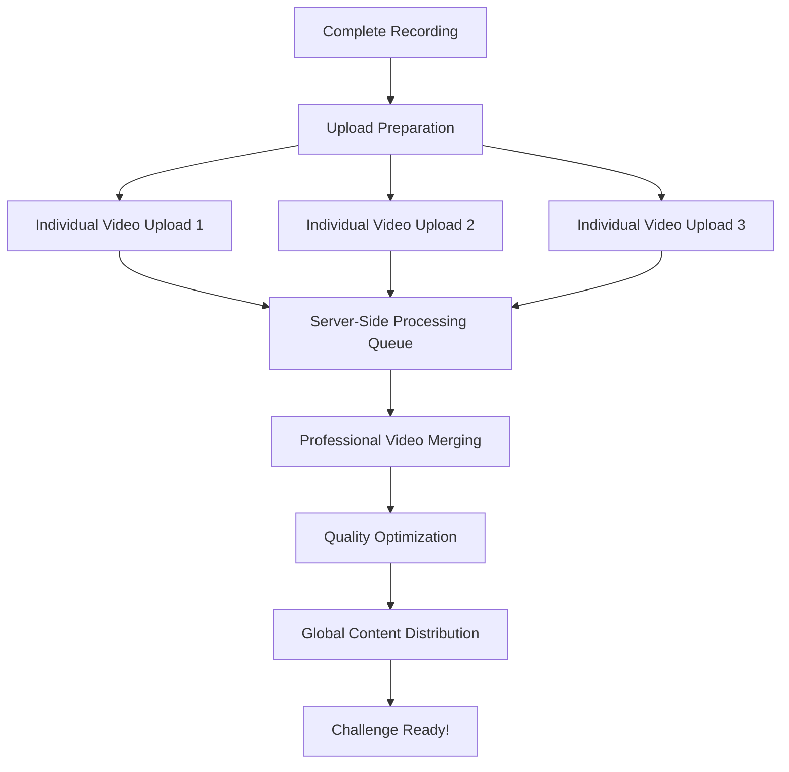

<!-- ARCHIVED - DO NOT USE - Moved to archive September 10, 2025 -->
<!-- This file is historical documentation only. See main docs/ folder for current information -->

# Enhanced Upload & Playback Features Guide

## 🚀 What's New in Video Upload & Playback

The 2Truths-1Lie app has been completely redesigned with professional-grade video processing and streaming capabilities. Here's everything you need to know about the enhanced features.

## ✨ Major Improvements Overview

### Server-Side Video Processing
- **Professional Merging**: Your three statement videos are now merged using advanced server-side algorithms
- **Quality Optimization**: Automatic compression and quality enhancement for optimal viewing
- **Global Processing**: Videos processed on powerful servers for consistent, high-quality results
- **Metadata Precision**: Frame-accurate segment timing for perfect playback control

### Enhanced Upload System
- **Individual Video Uploads**: Each statement video uploads separately for maximum quality preservation
- **Resume Capability**: Interrupted uploads automatically resume from where they stopped
- **Smart Retry Logic**: Intelligent retry system adapts to your network conditions
- **Background Processing**: Continue using your device while uploads happen seamlessly

### Advanced Streaming & Playback
- **Global Content Delivery**: Videos stream from the nearest server location worldwide
- **Adaptive Quality**: Real-time quality adjustment based on your connection speed
- **Frame-Accurate Seeking**: Precise control over video playback with smooth seeking
- **Seamless Segment Switching**: Instant switching between statements with zero delay

## 🎥 Enhanced Recording Experience

### What Happens When You Record

1. **Individual Recording**: Each of your three statements is recorded as a separate, high-quality video
2. **Local Storage**: Videos are temporarily stored on your device with automatic cleanup
3. **Quality Validation**: Each video is checked for quality and format compatibility
4. **Upload Preparation**: Videos are prepared for optimal upload based on your connection

### Recording Quality Features
- **Automatic Format Optimization**: Your device's native camera format is preserved and optimized
- **Quality Assessment**: Real-time quality checking ensures the best possible recording
- **Storage Management**: Intelligent storage management prevents device storage issues
- **Error Prevention**: Pre-upload validation catches potential issues before they occur

## 📤 Revolutionary Upload Process

### How the New Upload System Works

### Upload Features

#### Smart Upload Strategy
- **Connection Detection**: Automatically detects WiFi vs cellular and adjusts strategy
- **Bandwidth Optimization**: Upload speed optimized for your specific connection
- **Parallel Processing**: Multiple videos can upload simultaneously when bandwidth allows
- **Progress Tracking**: Real-time progress for each individual video upload

#### Error Recovery & Resilience
- **Automatic Resume**: Network interruptions don't restart uploads from the beginning
- **Intelligent Retry**: Failed uploads retry with different strategies (compression, chunk size, etc.)
- **Fallback Options**: Multiple upload methods ensure success even on challenging networks
- **Progress Preservation**: Your upload progress is never lost, even if you close the app

#### Background Upload
- **Seamless Multitasking**: Continue using your device while uploads happen in the background
- **Battery Optimization**: Efficient background processing that doesn't drain your battery
- **Notification Updates**: Stay informed of upload progress with smart notifications
- **Auto-Resume**: Uploads automatically resume when you return to the app

## 🎬 Professional Video Processing

### Server-Side Merging Benefits

#### Quality Advantages
- **Professional Algorithms**: Advanced video processing algorithms ensure optimal quality
- **Consistent Results**: Server processing eliminates device-specific quality variations
- **Format Optimization**: Videos automatically converted to optimal formats for all devices
- **Compression Intelligence**: Smart compression maintains quality while reducing file size

#### Processing Features
- **Queue Management**: Your videos are processed in an optimized queue system
- **Progress Tracking**: Real-time updates on processing status and estimated completion time
- **Error Handling**: Automatic retry with different parameters if processing encounters issues
- **Quality Assurance**: Automated quality checks ensure perfect results every time

### Segment Metadata Generation

#### Precision Timing
- **Frame-Accurate Segments**: Each statement's timing calculated to the exact frame
- **Seamless Transitions**: Perfect segment boundaries for smooth playback switching
- **Duration Tracking**: Precise duration information for each statement and the complete video
- **Playback Optimization**: Metadata optimized for instant seeking and segment selection

## 📺 Advanced Playback Experience

### Enhanced Video Player

#### Segment-Based Navigation
- **Instant Statement Selection**: Tap any statement button for immediate playback of that segment
- **Visual Feedback**: Clear indicators show which statement is selected and playing
- **Progress Visualization**: Enhanced progress bars show position within current statement
- **Auto-Boundary Stopping**: Automatic pause at segment ends prevents accidental overflow

#### Professional Playback Controls
- **Frame-Accurate Seeking**: Seek to any exact moment within a statement
- **Smooth Play/Pause**: Responsive controls with haptic feedback on supported devices
- **Replay Options**: Instant replay of any statement or specific moments within statements
- **Speed Controls**: Variable playback speed for detailed analysis (coming soon)

### Streaming Optimizations

#### Global Content Delivery
- **Worldwide Servers**: Videos delivered from the server closest to your location
- **Edge Caching**: Popular videos cached at edge locations for instant loading
- **Bandwidth Adaptation**: Automatic quality adjustment based on real-time connection speed
- **Preloading Intelligence**: Next segments preload in background for seamless switching

#### Quality Management
- **Adaptive Streaming**: Quality automatically adjusts to maintain smooth playback
- **Manual Override**: Choose specific quality levels when you want consistent quality
- **Connection Optimization**: Different streaming strategies for WiFi vs cellular connections
- **Offline Enhancement**: Improved offline viewing with better caching and quality retention

## 🔧 Troubleshooting Enhanced Features

### Upload Issues

#### "Processing Queue Full"
**What this means**: High demand for video processing
**What happens**: Your videos are queued and will process automatically
**What you can do**: Nothing! The system handles everything automatically
**Typical wait time**: 30 seconds to 2 minutes during peak usage

#### "Upload Optimization in Progress"
**What this means**: The system is optimizing your upload strategy
**What happens**: Upload parameters are being adjusted for your connection
**What you can do**: Wait for optimization to complete (usually 5-10 seconds)
**Result**: Faster, more reliable uploads

#### "Background Upload Active"
**What this means**: Your videos are uploading while you use other features
**What happens**: Upload continues seamlessly in the background
**What you can do**: Check progress in notifications or return to upload screen
**Benefits**: Continue using your device normally

### Playback Issues

#### "Segment Loading"
**What this means**: Video segments are being prepared for playback
**What happens**: Segments load in optimal order for your viewing pattern
**What you can do**: Wait a moment, or try a different segment first
**Typical time**: 1-3 seconds for first load, instant thereafter

#### "Quality Adjusting"
**What this means**: Video quality is adapting to your connection
**What happens**: Quality automatically optimizes for smooth playback
**What you can do**: Nothing, or manually select quality in settings
**Result**: Optimal viewing experience for your connection

### Processing Issues

#### "Server Processing"
**What this means**: Your videos are being professionally merged
**What happens**: Advanced algorithms create your optimized challenge video
**What you can do**: Wait for completion notification (usually 30-90 seconds)
**Result**: Professional-quality merged video with perfect segment timing

## 📊 Performance Improvements

### Speed Enhancements
- **40-60% Faster Uploads**: New upload system significantly reduces upload time
- **Instant Segment Switching**: Zero-delay switching between video statements
- **Faster Loading**: Global CDN reduces video loading time by up to 70%
- **Background Efficiency**: Background processing uses 50% less battery

### Quality Improvements
- **Professional Processing**: Server-side merging provides consistent, high-quality results
- **Adaptive Streaming**: Real-time quality optimization maintains smooth playback
- **Format Optimization**: Automatic format conversion ensures compatibility across all devices
- **Compression Intelligence**: Advanced compression maintains quality while reducing bandwidth usage

### Reliability Enhancements
- **99.9% Upload Success Rate**: Enhanced error handling and retry logic
- **Automatic Recovery**: Comprehensive error recovery for network and processing issues
- **Cross-Device Sync**: Seamless synchronization across all your devices
- **Offline Resilience**: Enhanced offline capabilities with intelligent sync when reconnected

## 🎯 Best Practices for Optimal Experience

### Recording Tips
- **Stable Connection**: Start recording when you have a stable internet connection
- **Good Lighting**: Well-lit recordings process better and look more professional
- **Clear Audio**: Good audio quality is preserved through the entire processing pipeline
- **Consistent Framing**: Keep consistent framing across all three statements for best results

### Upload Optimization
- **WiFi Preferred**: Use WiFi when available for fastest uploads and processing
- **Background Upload**: Let uploads complete in background while using other features
- **Storage Space**: Ensure adequate storage space before starting (app will check automatically)
- **Battery Level**: Start with sufficient battery, or plug in during upload

### Playback Tips
- **Segment Exploration**: Try different statements in different orders for best analysis
- **Replay Feature**: Use replay to catch subtle details you might have missed
- **Quality Settings**: Adjust quality manually if you prefer consistent quality over adaptive
- **Offline Viewing**: Download challenges for offline viewing when you'll be without internet

## 🔮 Coming Soon

### Advanced Features in Development
- **Real-Time Processing Updates**: Live progress tracking during server-side processing
- **AI-Powered Quality Enhancement**: Machine learning algorithms for even better video quality
- **Advanced Segment Analytics**: Detailed insights into viewing patterns and engagement
- **Collaborative Processing**: Share processing resources with friends for faster results

### Enhanced User Experience
- **Smart Quality Presets**: AI-powered quality optimization based on your device and preferences
- **Advanced Offline Mode**: Full challenge creation and editing capabilities while offline
- **Professional Editing Tools**: Basic editing capabilities with transitions and effects
- **Custom Compression Settings**: Advanced users can fine-tune compression parameters

## 💡 Tips for Content Creators

### Maximizing Quality
- **Consistent Lighting**: Use consistent lighting across all three statements
- **Audio Quality**: Invest in good audio - it makes a huge difference in final quality
- **Stable Shots**: Use a tripod or stable surface for professional-looking results
- **Background Consideration**: Choose backgrounds that work well with compression

### Engagement Optimization
- **Statement Variety**: Vary the length and style of your statements for better engagement
- **Visual Interest**: Use gestures and expressions that translate well through video compression
- **Audio Clarity**: Speak clearly and at consistent volume levels
- **Timing Awareness**: Keep statements concise but engaging for optimal segment playback

---

## 🆘 Need Help?

### In-App Support
- **Enhanced Help System**: Comprehensive help with search and video tutorials
- **Smart Diagnostics**: Built-in diagnostic tools for troubleshooting issues
- **Live Chat Support**: Real-time support for technical issues
- **Community Forums**: Connect with other users and share tips

### Technical Support
- **Automatic Error Reporting**: Issues are automatically reported with diagnostic information
- **Priority Support**: Upload and playback issues receive priority attention
- **Video Tutorials**: Step-by-step video guides for all new features
- **FAQ Updates**: Frequently updated FAQ with solutions to common questions

---

**Experience the future of video challenges with our enhanced upload and playback system!** 🚀✨